# Table of Contents

1. [문서 개요](paas-ta_on_demand_redis_service_install_guide_v1.0.md#1)
   * [1.1. 목적](paas-ta_on_demand_redis_service_install_guide_v1.0.md#11)
   * [1.2. 범위](paas-ta_on_demand_redis_service_install_guide_v1.0.md#12)
   * [1.3. 시스템 구성도](paas-ta_on_demand_redis_service_install_guide_v1.0.md#13)
   * [1.4. 참고자료](paas-ta_on_demand_redis_service_install_guide_v1.0.md#14)
2. [On-Demand-Redis 서비스팩 설치](paas-ta_on_demand_redis_service_install_guide_v1.0.md#2)
   * [2.1. 설치 전 준비 사항](paas-ta_on_demand_redis_service_install_guide_v1.0.md#21)
   * [2.2. On-Demand-Redis 서비스 릴리즈 업로드](paas-ta_on_demand_redis_service_install_guide_v1.0.md#22)
   * [2.3. On-Demand-Redis 서비스 Deployment 파일 수정 및 배포](paas-ta_on_demand_redis_service_install_guide_v1.0.md#23)
3. [CF CLI를 이용한 On-Demand-Redis 서비스 브로커 등록](paas-ta_on_demand_redis_service_install_guide_v1.0.md#3)
   * [3.1. PaaS-TA에서 서비스 신청](paas-ta_on_demand_redis_service_install_guide_v1.0.md#31)
   * [3.2. Sample App에 서비스 바인드 신청 및 App 확인](paas-ta_on_demand_redis_service_install_guide_v1.0.md#32)
4. [Portal을 이용한 redis service test](paas-ta_on_demand_redis_service_install_guide_v1.0.md#4)
   * [4.1. 서비스 신청](paas-ta_on_demand_redis_service_install_guide_v1.0.md#41)
5. [Redis Client 툴 접속](paas-ta_on_demand_redis_service_install_guide_v1.0.md#5)
   * [5.1. Redis Desktop Manager 설치 및 연결](paas-ta_on_demand_redis_service_install_guide_v1.0.md#51)

## 1. 문서 개요

### 1.1. 목적

본 문서\(Redis 서비스팩 설치 가이드\)는 전자정부표준프레임워크 기반의 PaaS-TA에서 제공되는 서비스팩인 Redis 서비스팩을 Bosh를 이용하여 설치하는 방법과 PaaS-TA의 SaaS 형태로 제공하는 Application에서 Redis 서비스를 사용하는 방법을 기술하였다.

### 1.2. 범위

설치 범위는 Redis서비스팩을 검증하기 위한 기본 설치를 기준으로 작성하였다.

### 1.3. 시스템 구성도

본 문서의 설치된 시스템 구성도입니다. Redis, MariaDB, On-Demand 서비스 브로커로 최소사항을 구성하였다. 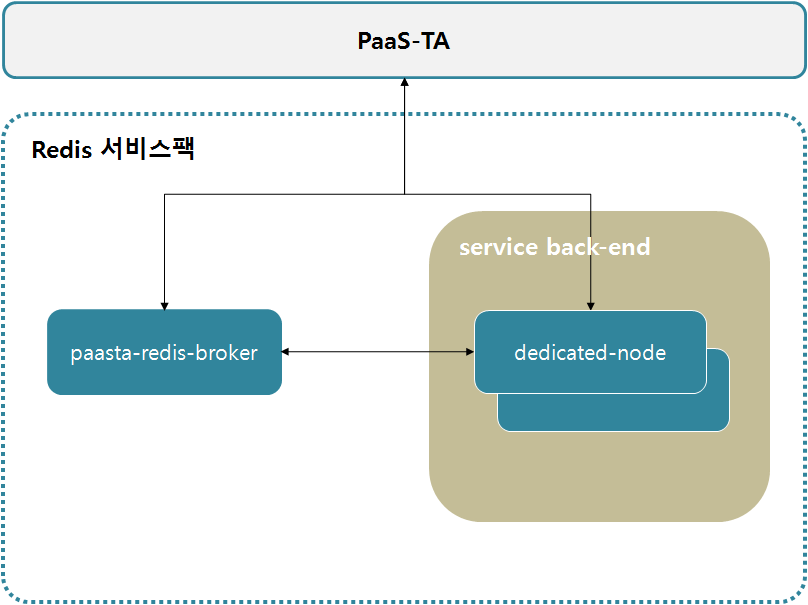

| 구분 | 스펙 |
| :--- | :--- |
| on-demand-service-broker | 1vCPU / 1GB RAM / 4GB Disk |
| Mariadb | 1vCPU / 256MB RAM / 4GB Disk+2GB\(영구적 Disk\) |
| Redis | 1vCPU / 256MB RAM / 4GB Disk+1GB\(영구적 Disk\) |

### 1.4. 참고자료

[**http://bosh.io/docs**](http://bosh.io/docs)   
 [**http://docs.cloudfoundry.org/**](http://docs.cloudfoundry.org/)

## 2. On-Demand Redis 서비스팩 설치

### 2.1. **설치 전 준비 사항**

본 설치 가이드는 Linux 환경에서 설치하는 것을 기준으로 하였다. 서비스팩 설치를 위해서는 BOSH 2.0과 PaaS-TA 5.0, PaaS-TA 포털이 설치되어 있어야 한다.

### 2.2. On-Demand Redis 서비스 릴리즈 업로드

* 업로드 되어 있는 릴리즈 목록을 확인한다.
* **사용 예시**

  \`\`\`  
  $ bosh -e micro-bosh releases Using environment '10.30.40.111' as user 'admin' \(openid, bosh.admin\)

Name Version Commit Hash  
binary-buildpack 1.0.28 55c2ed3  
bosh-dns 1.10.0 _7c6515f  
bosh-dns-aliases 0.0.3_ eca9c5a  
bpm 1.0.3 d2f7197  
capi 1.74.0 8ee6a87  
cf-cli 1.11.0 c10235d  
cf-networking 2.20.0 87e77b2b  
cf-smoke-tests 40.0.44 2c0914f  
cf-syslog-drain 8.1 6e8acdd  
cfcr-etcd 1.3 _6a62d8f  
cflinuxfs2 1.257.0 57aa652  
cflinuxfs3 0.48.0 cff2599  
credhub 2.1.2 124eecf+  
diego 2.25.0 6442f8a5+  
docker 32.0.0_ 542c382  
dotnet-core-buildpack 2.2.3 2b25882  
garden-runc 1.17.2 fbf261d+  
go-buildpack 1.8.30 f78d9f0  
haproxy 9.3.0 _66eda42  
influxdb 1.5.1_ non-git  
java-buildpack 4.16.1 _c350503  
kubo 0.19.0_ c9294bb  
log-cache 2.0.2 6367c8f  
loggregator 104.4 10160fda  
loggregator-agent 3.2 4c622e2  
nats 26 _f407411  
nodejs-buildpack 1.6.38 f7c4b52  
paasta-portal-api-release 1.0_ 3c2fa86+  
php-buildpack 4.3.67 acf3565  
postgres 33 0c379264+  
python-buildpack 1.6.25 667dbea  
redis 14.0.1 _96f111b  
routing 0.184.0 f7acbb5  
ruby-buildpack 1.7.29 25d0a91  
silk 2.20.0 145ad84  
staticfile-buildpack 1.4.37 3839bd7  
statsd-injector 1.5.0_ 533c630  
syslog 11.4.0 feedfa7  
uaa 68.0 2549b3b

\(\*\) Currently deployed \(+\) Uncommitted changes

39 releases

Succeeded

```text
-    On-Demand Redis 서비스 릴리즈가 업로드 되어 있지 않은 것을 확인

-    Redis 서비스 릴리즈 파일을 업로드한다.
```

## Deployment 다운로드 파일 위치 경로

~/workspace/paasta-5.0/deployment/service-deployment/paasta-on-demand-redis-service

## 릴리즈 다운로드 파일 위치 경로

~/workspace/paasta-5.0/release/service/paasta-on-demand-redis-release.tgz

```text
- **사용 예시**
```

$ bosh -e micro-bosh upload-release paasta-on-demand-redis-release.tgz Using environment '10.30.40.111' as user 'admin' \(openid, bosh.admin\)

**\#\#\#\#\#\#\#\#\#\#\#\#\#\#\#\#\#\#\#\#\#\#\#\#\#\#\#\#\#\#\#\#\#\#\#\#\#\#\#\#\#\#\#\#\#\#\#\#\#\# 100.00% 110.24 MiB/s 0s**

Task 936150

Task 936150 \| 07:14:34 \| Extracting release: Extracting release \(00:00:01\) Task 936150 \| 07:14:35 \| Verifying manifest: Verifying manifest \(00:00:00\) Task 936150 \| 07:14:35 \| Resolving package dependencies: Resolving package dependencies \(00:00:00\) Task 936150 \| 07:14:35 \| Creating new packages: java/86d8b8f8115418addf836753c1735abe547d4105 \(00:00:05\) Task 936150 \| 07:14:40 \| Creating new packages: mariadb/59a218308c6c7dcf8795b531b53aa4a1c666ce00 \(00:00:35\) Task 936150 \| 07:15:15 \| Creating new packages: paas-ta-on-demand-broker/060339465a66f4a7e030c3c7cd13e85f46667ccc \(00:00:02\) Task 936150 \| 07:15:18 \| Creating new packages: redis-4/a3c434216eff51abbb62eadf23487cee73ba4b3e \(00:00:00\) Task 936150 \| 07:15:18 \| Creating new jobs: mariadb/ad604af5c5e5491e616b2dfcf9de2da34750daf5 \(00:00:00\) Task 936150 \| 07:15:18 \| Creating new jobs: paas-ta-on-demand-broker/fead34137d8f00e8ce8e58919d21f6fe1a513fcc \(00:00:00\) Task 936150 \| 07:15:18 \| Creating new jobs: redis/e4a06f84c345a755d6dcbc32e0031eca11cd3aec \(00:00:00\) Task 936150 \| 07:15:18 \| Creating new jobs: sanity-tests/866d68289c2fd6066c97be56011825bba2cc58d5 \(00:00:00\) Task 936150 \| 07:15:18 \| Release has been created: on-demand-release/1.0 \(00:00:00\)

Task 936150 Started Tue Jul 2 07:14:34 UTC 2019 Task 936150 Finished Tue Jul 2 07:15:18 UTC 2019 Task 936150 Duration 00:00:44 Task 936150 done

Succeeded

```text
-    업로드 된 Redis 릴리즈를 확인한다.

- **사용 예시**
```

$ bosh -e micro-bosh releases Using environment '10.30.40.111' as user 'admin' \(openid, bosh.admin\)

Name Version Commit Hash  
binary-buildpack 1.0.28 55c2ed3  
bosh-dns 1.10.0 _7c6515f  
bosh-dns-aliases 0.0.3_ eca9c5a  
bpm 1.0.3 d2f7197  
capi 1.74.0 8ee6a87  
cf-cli 1.11.0 c10235d  
cf-networking 2.20.0 87e77b2b  
cf-smoke-tests 40.0.44 2c0914f  
cf-syslog-drain 8.1 6e8acdd  
cfcr-etcd 1.3 _6a62d8f  
cflinuxfs2 1.257.0 57aa652  
cflinuxfs3 0.48.0 cff2599  
credhub 2.1.2 124eecf+  
diego 2.25.0 6442f8a5+  
docker 32.0.0_ 542c382  
dotnet-core-buildpack 2.2.3 2b25882  
garden-runc 1.17.2 fbf261d+  
go-buildpack 1.8.30 f78d9f0  
haproxy 9.3.0 _66eda42  
influxdb 1.5.1_ non-git  
java-buildpack 4.16.1 _c350503  
kubo 0.19.0_ c9294bb  
log-cache 2.0.2 6367c8f  
loggregator 104.4 10160fda  
loggregator-agent 3.2 4c622e2  
nats 26 _f407411  
nodejs-buildpack 1.6.38 f7c4b52  
on-demand-redis-release 1.0 empty+  
paasta-portal-api-release 1.0_ 3c2fa86+  
php-buildpack 4.3.67 acf3565  
postgres 33 0c379264+  
python-buildpack 1.6.25 667dbea  
redis 14.0.1 _96f111b  
routing 0.184.0 f7acbb5  
ruby-buildpack 1.7.29 25d0a91  
silk 2.20.0 145ad84  
staticfile-buildpack 1.4.37 3839bd7  
statsd-injector 1.5.0_ 533c630  
syslog 11.4.0 feedfa7  
uaa 68.0 2549b3b

\(\*\) Currently deployed \(+\) Uncommitted changes

40 releases

Succeeded

```text
-    On-Demand-Redis 서비스 릴리즈가 업로드 되어 있는 것을 확인

-    Deploy시 사용할 Stemcell을 확인한다.

- **사용 예시**
```

$ bosh -e micro-bosh stemcells Name Version OS CPI CID  
bosh-openstack-kvm-ubuntu-xenial-go\_agent 315.64\* ubuntu-xenial - fb08e389-2350-4091-9b29-41743495e62c

\(\*\) Currently deployed

1 stemcells

Succeeded

```text
### <div id='23'>  2.3. On-Demand Redis 서비스 Deployment 파일 수정 및 배포
BOSH Deployment manifest 는 components 요소 및 배포의 속성을 정의한 YAML 파일이다.
Deployment manifest 에는 sotfware를 설치 하기 위해서 어떤 Stemcell (OS, BOSH agent) 을 사용할것이며 Release (Software packages, Config templates, Scripts) 이름과 버전, VMs 용량, Jobs params 등을 정의가 되어 있다.

deployment 파일에서 사용하는 network, vm_type 등은 cloud config 를 활용하고 해당 가이드는 Bosh2.0 가이드를 참고한다.

-    cloud config 내용 조회

- **사용 예시**
```

$ bosh -e micro-bosh cloud-config Using environment '10.30.40.111' as user 'admin' \(openid, bosh.admin\)

azs:

* cloud\_properties:

    datacenters:

  * clusters:
    * BD-HA:

      resource\_pool: CF\_BOSH2\_Pool

      name: BD-HA

      name: z1

* cloud\_properties:

    datacenters:

  * clusters:
    * BD-HA:

      resource\_pool: CF\_BOSH2\_Pool

      name: BD-HA

      name: z2

* cloud\_properties:

    datacenters:

  * clusters:
    * BD-HA:

      resource\_pool: CF\_BOSH2\_Pool

      name: BD-HA

      name: z3

* cloud\_properties:

    datacenters:

  * clusters:
    * BD-HA:

      resource\_pool: CF\_BOSH2\_Pool

      name: BD-HA

      name: z4

* cloud\_properties:

    datacenters:

  * clusters:
    * BD-HA:

      resource\_pool: CF\_BOSH2\_Pool

      name: BD-HA

      name: z5

* cloud\_properties:

    datacenters:

  * clusters:
    * BD-HA:

      resource\_pool: CF\_BOSH2\_Pool

      name: BD-HA

      name: z6

      compilation:

      az: z1

      network: default

      reuse\_compilation\_vms: true

      vm\_type: large

      workers: 5

      disk\_types:

* disk\_size: 1024

  name: default

* disk\_size: 1024

  name: 1GB

* disk\_size: 2048

  name: 2GB

* disk\_size: 4096

  name: 4GB

* disk\_size: 5120

  name: 5GB

* disk\_size: 8192

  name: 8GB

* disk\_size: 10240

  name: 10GB

* disk\_size: 20480

  name: 20GB

* disk\_size: 30720

  name: 30GB

* disk\_size: 51200

  name: 50GB

* disk\_size: 102400

  name: 100GB

* disk\_size: 1048576

  name: 1TB

  networks:

* name: default

  subnets:

  * azs:
    * z1
    * z2
    * z3
    * z4
    * z5
    * z6

      cloud\_properties:

      name: Internal

      dns:

    * 8.8.8.8

      gateway: 10.30.20.23

      range: 10.30.0.0/16

      reserved:

    * 10.30.0.0 - 10.30.111.40

* name: public

  subnets:

  * azs:
    * z1
    * z2
    * z3
    * z4
    * z5
    * z6

      cloud\_properties:

      name: External

      dns:

    * 8.8.8.8

      gateway: 115.68.46.177

      range: 115.68.46.176/28

      reserved:

    * 115.68.46.176 - 115.68.46.188

      static:

    * 115.68.46.189 - 115.68.46.190

      type: manual

* name: service\_private

  subnets:

  * azs:
    * z1
    * z2
    * z3
    * z4
    * z5
    * z6

      cloud\_properties:

      name: Internal

      dns:

    * 8.8.8.8

      gateway: 10.30.20.23

      range: 10.30.0.0/16

      reserved:

    * 10.30.0.0 - 10.30.106.255

      static:

    * 10.30.107.1 - 10.30.107.255

* name: service\_public

  subnets:

  * azs:
    * z1
    * z2
    * z3
    * z4
    * z5
    * z6

      cloud\_properties:

      name: External

      dns:

    * 8.8.8.8

      gateway: 115.68.47.161

      range: 115.68.47.160/24

      reserved:

    * 115.68.47.161 - 115.68.47.174

      static:

    * 115.68.47.175 - 115.68.47.185

      type: manual

* name: portal\_service\_public

  subnets:

  * azs:
    * z1
    * z2
    * z3
    * z4
    * z5
    * z6

      cloud\_properties:

      name: External

      dns:

    * 8.8.8.8

      gateway: 115.68.46.209

      range: 115.68.46.208/28

      reserved:

    * 115.68.46.216 - 115.68.46.222

      static:

    * 115.68.46.214

      type: manual

      vm\_extensions:

* cloud\_properties:

    ports:

  * host: 3306

    name: mysql-proxy-lb

* name: cf-router-network-properties
* name: cf-tcp-router-network-properties
* name: diego-ssh-proxy-network-properties
* name: cf-haproxy-network-properties
* cloud\_properties:

    disk: 51200

  name: small-50GB

* cloud\_properties:

    disk: 102400

  name: small-highmem-100GB

  vm\_types:

* cloud\_properties:

    cpu: 1

    disk: 8192

    ram: 1024

  name: minimal

* cloud\_properties:

    cpu: 1

    disk: 10240

    ram: 2048

  name: default

* cloud\_properties:

    cpu: 1

    disk: 30720

    ram: 4096

  name: small

* cloud\_properties:

    cpu: 2

    disk: 20480

    ram: 4096

  name: medium

* cloud\_properties:

    cpu: 2

    disk: 20480

    ram: 8192

  name: medium-memory-8GB

* cloud\_properties:

    cpu: 4

    disk: 20480

    ram: 8192

  name: large

* cloud\_properties:

    cpu: 8

    disk: 20480

    ram: 16384

  name: xlarge

* cloud\_properties:

    cpu: 2

    disk: 51200

    ram: 4096

  name: small-50GB

* cloud\_properties:

    cpu: 2

    disk: 51200

    ram: 4096

  name: small-50GB-ephemeral-disk

* cloud\_properties:

    cpu: 4

    disk: 102400

    ram: 8192

  name: small-100GB-ephemeral-disk

* cloud\_properties:

    cpu: 4

    disk: 102400

    ram: 8192

  name: small-highmem-100GB-ephemeral-disk

* cloud\_properties:

    cpu: 8

    disk: 20480

    ram: 16384

  name: small-highmem-16GB

* cloud\_properties:

    cpu: 1

    disk: 4096

    ram: 2048

  name: caas\_small

* cloud\_properties:

    cpu: 1

    disk: 4096

    ram: 1024

  name: caas\_small\_api

* cloud\_properties:

    cpu: 1

    disk: 4096

    ram: 4096

  name: caas\_medium

* cloud\_properties:

    cpu: 2

    disk: 8192

    ram: 4096

  name: service\_medium

* cloud\_properties:

    cpu: 2

    disk: 10240

    ram: 2048

  name: service\_medium\_2G

Succeeded

```text
-    Deployment 파일을 서버 환경에 맞게 수정한다.

```yml
# paasta_on_demand_service_broker.yml 설정 파일 내용

---
name: "((deployment_name))"        #서비스 배포이름(필수) bosh deployments 로 확인 가능한 이름
# director_uuid: <%= `bosh status --uuid` %>                  # Director UUID을 입력(필수) bosh status 명령으로 확인 가능

stemcells:
- alias: "((stemcell_alias))"
  os: "((stemcell_os))"
  version: "((stemcell_version))"

addons:
- name: bpm
  jobs:
  - name: bpm
    release: bpm

variables:
- name: redis-password
  type: password

releases:
- name: bpm
  sha1: f2bd126b17b3591160f501d88d79ccf0aba1ae54
  url: git+https://github.com/cloudfoundry-incubator/bpm-release  # 외부통신이 불가능할 경우 bpm 1.0.3 버전을 미리 릴리즈 해야 한다.  
  version: 1.0.3
- name: "((releases_name))"                  # 서비스 릴리즈 이름(필수) bosh releases로 확인 가능
  version: "1.0"                                             # 서비스 릴리즈 버전(필수):latest 시 업로드된 서비스 릴리즈 최신버전

update:
  canaries: 1                                               # canary 인스턴스 수(필수)
  canary_watch_time: 5000-120000                            # canary 인스턴스가 수행하기 위한 대기 시간(필수)
  update_watch_time: 5000-120000                            # non-canary 인스턴스가 수행하기 위한 대기 시간(필수)
  max_in_flight: 1                                          # non-canary 인스턴스가 병렬로 update 하는 최대 개수(필수)
  serial: false

instance_groups:
########## INFRA ##########
- name: mariadb
  azs:
  - z3
  instances: 1
  vm_type: service_tiny 
  stemcell: "((stemcell_alias))"
  persistent_disk_type: "((mariadb_disk_type))"
  networks:
  - name: "((internal_networks_name))"
  templates:
  - name: mariadb
    release: "((releases_name))"
  syslog_aggregator: null

######## BROKER ########

- name: paas-ta-on-demand-broker
  azs:
  - z3
  instances: 1
  vm_type: service_medium
  stemcell: "((stemcell_alias))"
  networks:
  - name: "((internal_networks_name))"
  templates:
  - name: paas-ta-on-demand-broker
    release: "((releases_name))"
  syslog_aggregator: null
- name: redis
  azs: 
  - z3
  instances: 1 
  vm_type: service_tiny
  stemcell: "((stemcell_alias))"
  persistent_disk: 1024
  networks:
  - name: "((internal_networks_name))"
  jobs:
  - name: redis
    release: "((releases_name))"
- name: sanity-tests
  azs:
  - z3
  instances: 1
  lifecycle: errand
  vm_type: service_tiny
  stemcell: "((stemcell_alias))"
  networks: 
  - name: "((internal_networks_name))"
  jobs:
  - name: sanity-tests
    release: "((releases_name))"

######### COMMON PROPERTIES ##########
properties:
  broker:
    server:
      port: "((broker_port))"
    datasource:
      password: "((mariadb_user_password))"
    service_instance:
      guid: "((service_instance_guid))"
      name: "((service_instance_name))"
      bullet:
        name: "((service_instance_bullet_name))"
        desc: "((service_instance_bullet_desc))"
      plan: 
        id: "((service_instance_plan_guid))"
        name: "((service_instance_plan_name))"
        desc: "((service_instance_plan_desc))"
      org_limitation: "((service_instance_org_limitation))"
      space_limitation: "((service_instance_space_limitation))"
    bosh:
      client_id: "((bosh_client_admin_id))"
      client_secret: "((bosh_client_admin_secret))"
      url: ((bosh_url)):((bosh_director_port))
      oauth_url: ((bosh_url)):((bosh_oauth_port))
      deployment_name: "((deployment_name))"
      instance_name: "((on_demand_service_instance_name))"
    cloudfoundry:
      url: "((cloudfoundry_url))"
      sslSkipValidation: "((cloudfoundry_sslSkipValidation))"
      admin:
        id: "((cloudfoundry_admin_id))"
        password: "((cloudfoundry_admin_password))"
  mariadb:                                                # MARIA DB SERVER 설정 정보
    port: "((mariadb_port))"                                            # MARIA DB PORT 번호
    admin_user:
      password: "((mariadb_user_password))"                             # MARIA DB ROOT 계정 비밀번호
    host_names:
    - mariadb0
######### SERVICE PROPERTIES #################
  redis:
    password: "((redis_password))"
```

* necessary\_on\_demand\_vars.yml\(인프라 환경\), unnecessary\_on\_demand\_vars.yml\(브로커환경\) 수정한다.
* deploy-vsphere.sh를 확인후 배포한다.

  ```bash
  #!/bin/bash
  bosh -d on-demand-service-broker deploy paasta_on_demand_service_broker.yml \
   -l necessary_on_demand_vars.yml\
   -l unnecessary_on_demand_vars.yml
  ```

```text
necessary_on_demand_vars.yml

#!/bin/bash

---
### On-Demand Bosh Deployment Name Setting ###
deployment_name: on-demand-service-broker                       #On-Demand Deployment Name을 지정한다.

### Main Stemcells Setting ###
stemcell_os: ubuntu-xenial                                      # Deployment Main Stemcell OS
stemcell_version: 315.64                                       # Main Stemcell Version
stemcell_alias: default                                         # Main Stemcell Alias

### On-Demand Release Deployment Setting ### 
releases_name : on-demand-redis-release                         # On-Demand Release Name
internal_networks_name : service_private                        # Some Network From Your 'bosh cloud-config(cc)'
mariadb_disk_type : 2GB                                         # MariaDB Disk Type 'bosh cloud-config(cc)' 2G 이하로 할당할 경우 에러 발생
broker_port : 8080                                              # On-Demand Broker Server Port 서비스 브로커 등록할때 접근할 포트를 지정한다.
bosh_client_admin_id: admin                                     # Bosh Client Admin ID 를 입력한다.
bosh_client_admin_secret:                                       # Bosh Client Admin Secret을 입력한다.
bosh_url: https://xxx.xxx.xxx.xxx                               # Bosh URL을 입력한다. 'bosh env' 명령어를 치면 알 수 있다.
bosh_director_port: 25555                                       # Bosh API Port
bosh_oauth_port: 8443                                           # Bosh Oauth Port

cloudfoundry_url: xxx.xxx.xxx.xxx.xip.io                        # CloudFoundry URL
cloudfoundry_sslSkipValidation: true                            # CloudFoundry Login SSL Validation
cloudfoundry_admin_id: admin                                    # CloudFoundry Admin ID
cloudfoundry_admin_password:                                    # CloudFoundry Admin Password

### On-Demand Service Property(Changes are possible) ###
mariadb_port: 3306                                              # MariaDB Server Port
mariadb_user_password:                                          # MariaDB Root Password(임의로 지정한다.)

### On-Demand Dedicated Service Instance Properties ###

on_demand_service_instance_name: redis                          # On-Demand Service Instance Name
service_password: admin_test                                    # Dedicated Service Password
service_port: 6379                                              # Dedicated Service Port
```

현재 On-Demand Service는 Plan 1개만 입력받도록 되어있다.

```text
service_instance_guid: 54e2de61-de84-4b9c-afc3-88d08aadfcb6                # Service Instance Guid 이볅한다.
service_instance_name: redis                                               # Service Instance Name 입력한다.
service_instance_bullet_name: Redis Dedicated Server Use                   # Service Instance bullet Name을 입력한다.
service_instance_bullet_desc: Redis Service Using a Dedicated Server       # Service Instance bullet에 대한 설명을 입력한다.
service_instance_plan_guid: 2a26b717-b8b5-489c-8ef1-02bcdc445720           # Service Instance Plan Guid를 입력한다.
service_instance_plan_name: dedicated-vm                                   # Service Instance Plan Name을 입력한다.
service_instance_plan_desc: Redis service to provide a key-value store     # Service Instance Plan에 대한 설명을 입력한다.
service_instance_org_limitation: -1                                        # Org에 설치할수 있는 Service Instance 개수를 제한한다. (-1일경우 제한없음)
service_instance_space_limitation: -1                                      # Space에 설치할수 있는 Service Instance 개수를 제한한다. (-1일경우 제한없음)
```

* On-Demand-Redis 서비스팩을 배포한다.
* **사용 예시**

  \`\`\`  
  $ sh deploy-vsphere.sh Using environment '10.30.40.111' as client 'admin'

Using deployment 'on-demand-service-broker'

Release 'bpm/1.0.3' already exists.

* azs:
* * cloud\_properties:
* datacenters:
* * clusters:
* * BD-HA:
* resource\_pool: PAASTA\_40\_BOSH2\_Pools
* name: BD-HA
* name: z1
* * cloud\_properties:
* datacenters:
* * clusters:
* * BD-HA:
* resource\_pool: PAASTA\_40\_BOSH2\_Pools
* name: BD-HA
* name: z2
* * cloud\_properties:
* datacenters:
* * clusters:
* * BD-HA:
* resource\_pool: PAASTA\_40\_BOSH2\_Pools
* name: BD-HA
* name: z3
* * cloud\_properties:
* datacenters:
* * clusters:
* * BD-HA:
* resource\_pool: PAASTA\_40\_BOSH2\_Pools
* name: BD-HA
* name: z4
* * cloud\_properties:
* datacenters:
* * clusters:
* * BD-HA:
* resource\_pool: PAASTA\_40\_BOSH2\_Pools
* name: BD-HA
* name: z5
* * cloud\_properties:
* datacenters:
* * clusters:
* * BD-HA:
* resource\_pool: PAASTA\_40\_BOSH2\_Pools
* name: BD-HA
* name: z6
* * cloud\_properties:
* datacenters:
* * clusters:
* * BD-HA:
* resource\_pool: PAASTA\_40\_BOSH2\_Pools
* name: BD-HA
* name: z7
* vm\_types:
* * cloud\_properties:
* cpu: 1
* disk: 8192
* ram: 1024
* name: minimal
* * cloud\_properties:
* cpu: 1
* disk: 10240
* ram: 2048
* name: default
* * cloud\_properties:
* cpu: 1
* disk: 30720
* ram: 4096
* name: small
* * cloud\_properties:
* cpu: 2
* disk: 20480
* ram: 4096
* name: medium
* * cloud\_properties:
* cpu: 2
* disk: 20480
* ram: 8192
* name: medium-memory-8GB
* * cloud\_properties:
* cpu: 4
* disk: 20480
* ram: 8192
* name: large
* * cloud\_properties:
* cpu: 8
* disk: 20480
* ram: 16384
* name: xlarge
* * cloud\_properties:
* cpu: 2
* disk: 51200
* ram: 4096
* name: small-50GB
* * cloud\_properties:
* cpu: 2
* disk: 51200
* ram: 4096
* name: small-50GB-ephemeral-disk
* * cloud\_properties:
* cpu: 4
* disk: 102400
* ram: 8192
* name: small-100GB-ephemeral-disk
* * cloud\_properties:
* cpu: 4
* disk: 102400
* ram: 8192
* name: small-highmem-100GB-ephemeral-disk
* * cloud\_properties:
* cpu: 8
* disk: 20480
* ram: 16384
* name: small-highmem-16GB
* * cloud\_properties:
* cpu: 1
* disk: 4096
* ram: 2048
* name: caas\_small
* * cloud\_properties:
* cpu: 1
* disk: 4096
* ram: 1024
* name: caas\_small\_api
* * cloud\_properties:
* cpu: 1
* disk: 4096
* ram: 4096
* name: caas\_medium
* * cloud\_properties:
* cpu: 1
* disk: 4096
* ram: 256
* name: service\_tiny
* * cloud\_properties:
* cpu: 1
* disk: 4096
* ram: 512
* name: service\_small
* * cloud\_properties:
* cpu: 1
* disk: 4096
* ram: 1024
* name: service\_medium
* * cloud\_properties:
* cpu: 1
* disk: 4096
* ram: 2048
* name: service\_medium\_1CPU\_2G
* * cloud\_properties:
* cpu: 2
* disk: 8192
* ram: 4096
* name: service\_medium\_4G
* * cloud\_properties:
* cpu: 2
* disk: 10240
* ram: 2048
* name: service\_medium\_2G
* * cloud\_properties:
* cpu: 1
* disk: 4096
* ram: 256
* name: portal\_tiny
* * cloud\_properties:
* cpu: 1
* disk: 4096
* ram: 512
* name: portal\_small
* * cloud\_properties:
* cpu: 1
* disk: 4096
* ram: 1024
* name: portal\_medium
* * cloud\_properties:
* cpu: 1
* disk: 4096
* ram: 2048
* name: portal\_large
* vm\_extensions:
* * cloud\_properties:
* ports:
* * host: 3306
* name: mysql-proxy-lb
* * name: cf-router-network-properties
* * name: cf-tcp-router-network-properties
* * name: diego-ssh-proxy-network-properties
* * name: cf-haproxy-network-properties
* * cloud\_properties:
* disk: 51200
* name: small-50GB
* * cloud\_properties:
* disk: 102400
* name: small-highmem-100GB
* compilation:
* az: z1
* network: default
* reuse\_compilation\_vms: true
* vm\_type: large
* workers: 5
* networks:
* * name: default
* subnets:
* * azs:
* * z1
* * z2
* * z3
* * z4
* * z5
* * z6
* * z7
* cloud\_properties:
* name: Internal
* dns:
* * 8.8.8.8
* gateway: 10.30.20.23
* range: 10.30.0.0/16
* reserved:
* * 10.30.0.0 - 10.30.100.255
* * name: public
* subnets:
* * azs:
* * z1
* * z2
* * z3
* * z4
* * z5
* * z6
* * z7
* cloud\_properties:
* name: External
* dns:
* * 8.8.8.8
* gateway: 115.68.46.177
* range: 115.68.46.176/28
* reserved:
* * 115.68.46.176 - 115.68.46.187
* static:
* * 115.68.46.188 - 115.68.46.190
* type: manual
* * name: service\_private
* subnets:
* * azs:
* * z1
* * z2
* * z3
* * z4
* * z5
* * z6
* * z7
* cloud\_properties:
* name: Internal
* dns:
* * 8.8.8.8
* gateway: 10.30.20.23
* range: 10.30.0.0/16
* reserved:
* * 10.30.0.0 - 10.30.49.255
* static:
* * 10.30.50.0 - 10.30.254.255
* * name: service\_public
* subnets:
* * azs:
* * z1
* * z2
* * z3
* * z4
* * z5
* * z6
* * z7
* cloud\_properties:
* name: External
* dns:
* * 8.8.8.8
* gateway: 115.68.47.161
* range: 115.68.47.160/24
* reserved:
* * 115.68.47.161 - 115.68.47.174
* static:
* * 115.68.47.175 - 115.68.47.190
* type: manual
* * name: portal\_service\_public
* subnets:
* * azs:
* * z1
* * z2
* * z3
* * z4
* * z5
* * z6
* * z7
* cloud\_properties:
* name: External
* dns:
* * 8.8.8.8
* gateway: 115.68.46.209
* range: 115.68.46.208/28
* reserved:
* * 115.68.46.217 - 115.68.46.222
* static:
* * 115.68.46.213 - 115.68.46.215
* type: manual
* * name: vip
* type: vip
* disk\_types:
* * disk\_size: 1024
* name: default
* * disk\_size: 1024
* name: 1GB
* * disk\_size: 2048
* name: 2GB
* * disk\_size: 4096
* name: 4GB
* * disk\_size: 5120
* name: 5GB
* * disk\_size: 8192
* name: 8GB
* * disk\_size: 10240
* name: 10GB
* * disk\_size: 20480
* name: 20GB
* * disk\_size: 30720
* name: 30GB
* * disk\_size: 51200
* name: 50GB
* * disk\_size: 102400
* name: 100GB
* * disk\_size: 1048576
* name: 1TB
* stemcells:
* * alias: default
* os: ubuntu-xenial
* version: '315.64'
* releases:
* * name: bpm
* sha1: f2bd126b17b3591160f501d88d79ccf0aba1ae54
* url: git+[https://github.com/cloudfoundry-incubator/bpm-release](https://github.com/cloudfoundry-incubator/bpm-release)
* version: 1.0.3
* * name: on-demand-release
* version: '1.0'
* * name: bosh-dns
* sha1: d1aadbda5d60c44dec4a429cda872cf64f6d8d0b
* url: [https://bosh.io/d/github.com/cloudfoundry/bosh-dns-release?v=1.10.0](https://bosh.io/d/github.com/cloudfoundry/bosh-dns-release?v=1.10.0)
* version: 1.10.0
* update:
* canaries: 1
* canary\_watch\_time: 5000-120000
* max\_in\_flight: 1
* serial: false
* update\_watch\_time: 5000-120000
* addons:
* * include:
* deployments:
* * paasta
* stemcell:
* * os: ubuntu-trusty
* * os: ubuntu-xenial
* jobs:
* * name: bosh-dns
* properties:
* api:
* client:
* tls: ""
* server:
* tls: ""
* cache:
* enabled: ""
* health:
* client:
* tls: ""
* enabled: ""
* server:
* tls: ""
* release: bosh-dns
* name: bosh-dns
* * include:
* stemcell:
* * os: windows2012R2
* * os: windows2016
* * os: windows1803
* * os: windows2019
* jobs:
* * name: bosh-dns-windows
* properties:
* api:
* client:
* tls: ""
* server:
* tls: ""
* cache:
* enabled: ""
* health:
* client:
* tls: ""
* enabled: ""
* server:
* tls: ""
* release: bosh-dns
* name: bosh-dns-windows
* variables:
* * name: redis-password
* type: password
* * name: "/dns\_healthcheck\_tls\_ca"
* options:
* common\_name: dns-healthcheck-tls-ca
* is\_ca: true
* type: certificate
* * name: "/dns\_healthcheck\_server\_tls"
* options:
* ca: "/dns\_healthcheck\_tls\_ca"
* common\_name: health.bosh-dns
* extended\_key\_usage:
* * server\_auth
* type: certificate
* * name: "/dns\_healthcheck\_client\_tls"
* options:
* ca: "/dns\_healthcheck\_tls\_ca"
* common\_name: health.bosh-dns
* extended\_key\_usage:
* * client\_auth
* type: certificate
* * name: "/dns\_api\_tls\_ca"
* options:
* common\_name: dns-api-tls-ca
* is\_ca: true
* type: certificate
* * name: "/dns\_api\_server\_tls"
* options:
* ca: "/dns\_api\_tls\_ca"
* common\_name: api.bosh-dns
* extended\_key\_usage:
* * server\_auth
* type: certificate
* * name: "/dns\_api\_client\_tls"
* options:
* ca: "/dns\_api\_tls\_ca"
* common\_name: api.bosh-dns
* extended\_key\_usage:
* * client\_auth
* type: certificate
* instance\_groups:
* * azs:
* * z3
* instances: 1
* name: mariadb
* networks:
* * name: service\_private
* persistent\_disk\_type: 2GB
* stemcell: default
* syslog\_aggregator: 
* templates:
* * name: mariadb
* release: on-demand-release
* vm\_type: service\_tiny
* * azs:
* * z3
* instances: 1
* name: paas-ta-on-demand-broker
* networks:
* * name: service\_private
* stemcell: default
* syslog\_aggregator: 
* templates:
* * name: paas-ta-on-demand-broker
* release: on-demand-release
* vm\_type: service\_medium
* * azs:
* * z3
* instances: 0
* jobs:
* * name: redis
* release: on-demand-release
* name: redis
* networks:
* * name: service\_private
* persistent\_disk: 1024
* stemcell: default
* vm\_type: service\_tiny
* * azs:
* * z3
* instances: 1
* jobs:
* * name: sanity-tests
* release: on-demand-release
* lifecycle: errand
* name: sanity-tests
* networks:
* * name: service\_private
* stemcell: default
* vm\_type: service\_tiny
* name: on-demand-service-broker
* properties:
* broker:
* bosh:
* client\_id: ""
* client\_secret: ""
* deployment\_name: ""
* instance\_name: ""
* oauth\_url: ""
* url: ""
* cloudfoundry:
* admin:
* id: ""
* password: ""
* sslSkipValidation: ""
* url: ""
* datasource:
* password: ""
* server:
* port: ""
* service\_instance:
* bullet:
* desc: ""
* name: ""
* guid: ""
* name: ""
* org\_limitation: ""
* plan:
* desc: ""
* id: ""
* name: ""
* space\_limitation: ""
* mariadb:
* admin\_user:
* password: ""
* host\_names:
* * ""
* port: ""
* redis:
* password: ""

  Continue? \[yN\]: y

  Task 936164

Task 936164 \| 07:29:51 \| Preparing deployment: Preparing deployment \(00:00:07\) Task 936164 \| 07:29:59 \| Preparing package compilation: Finding packages to compile \(00:00:00\) Task 936164 \| 07:29:59 \| Compiling packages: redis-4/a3c434216eff51abbb62eadf23487cee73ba4b3e Task 936164 \| 07:29:59 \| Compiling packages: java/86d8b8f8115418addf836753c1735abe547d4105 Task 936164 \| 07:29:59 \| Compiling packages: mariadb/59a218308c6c7dcf8795b531b53aa4a1c666ce00 Task 936164 \| 07:29:59 \| Compiling packages: paas-ta-on-demand-broker/060339465a66f4a7e030c3c7cd13e85f46667ccc Task 936164 \| 07:32:42 \| Compiling packages: java/86d8b8f8115418addf836753c1735abe547d4105 \(00:02:43\) Task 936164 \| 07:32:48 \| Compiling packages: paas-ta-on-demand-broker/060339465a66f4a7e030c3c7cd13e85f46667ccc \(00:02:49\) Task 936164 \| 07:33:32 \| Compiling packages: mariadb/59a218308c6c7dcf8795b531b53aa4a1c666ce00 \(00:03:33\) Task 936164 \| 07:33:58 \| Compiling packages: redis-4/a3c434216eff51abbb62eadf23487cee73ba4b3e \(00:03:59\) Task 936164 \| 07:34:47 \| Creating missing vms: paas-ta-on-demand-broker/13c11522-10dd-485c-bb86-3ac5337223d0 \(0\) Task 936164 \| 07:34:47 \| Creating missing vms: mariadb/e35f3ece-9c34-41f4-a88e-d8365e9b8c70 \(0\) Task 936164 \| 07:36:12 \| Creating missing vms: paas-ta-on-demand-broker/13c11522-10dd-485c-bb86-3ac5337223d0 \(0\) \(00:01:25\) Task 936164 \| 07:36:13 \| Creating missing vms: mariadb/e35f3ece-9c34-41f4-a88e-d8365e9b8c70 \(0\) \(00:01:26\) Task 936164 \| 07:36:15 \| Updating instance mariadb: mariadb/e35f3ece-9c34-41f4-a88e-d8365e9b8c70 \(0\) \(canary\) Task 936164 \| 07:36:15 \| Updating instance paas-ta-on-demand-broker: paas-ta-on-demand-broker/13c11522-10dd-485c-bb86-3ac5337223d0 \(0\) \(canary\) \(00:00:46\) Task 936164 \| 07:39:05 \| Updating instance mariadb: mariadb/e35f3ece-9c34-41f4-a88e-d8365e9b8c70 \(0\) \(canary\) \(00:02:50\)

Task 936164 Started Tue Jul 2 07:29:51 UTC 2019 Task 936164 Finished Tue Jul 2 07:39:05 UTC 2019 Task 936164 Duration 00:09:14 Task 936164 done

Succeeded

```text
-    배포된 On-Demand-Redis 서비스팩을 확인한다.

- **사용 예시**
```

$ bosh -e micro-bosh vms -d on-demand-service-broker Using environment '10.30.40.111' as user 'admin' \(openid, bosh.admin\)

Task 936167. Done

Deployment 'on-demand-service-broker'

Instance Process State AZ IPs VM CID VM Type Active  
mariadb/e35f3ece-9c34-41f4-a88e-d8365e9b8c70 running z3 10.30.255.25 vm-5168ec8d-f42f-40fa-9c3a-8635bf138b0a service\_tiny true  
paas-ta-on-demand-broker/13c11522-10dd-485c-bb86-3ac5337223d0 running z3 10.30.255.26 vm-eab6e832-8b7c-49bc-ac04-80258896880d service\_medium true

2 vms

Succeeded

```text
### <div id='3'> 3. CF CLI를 이용한 On-Demand-Redis 서비스 브로커 등록
Redis 서비스팩 배포가 완료 되었으면 Application에서 서비스 팩을 사용하기 위해서 먼저 On-Demand-Redis 서비스 브로커를 등록해 주어야 한다.
서비스 브로커 등록시에는 PaaS-TA에서 서비스 브로커를 등록할 수 있는 사용자로 로그인하여야 한다


##### 서비스 브로커 목록을 확인한다.

>`$ cf service-brokers`
```

Getting service brokers as admin...

name url paasta-pinpoint-broker [http://10.30.70.82:8080](http://10.30.70.82:8080)

```text
##### On-Demand-Redis 서비스 브로커를 등록한다.
>`$ cf create-service-broker {서비스팩 이름} {서비스팩 사용자ID} {서비스팩 사용자비밀번호} http://{서비스팩 URL(IP)}`

  **서비스팩 이름** : 서비스 팩 관리를 위해 PaaS-TA에서 보여지는 명칭이다. 서비스 Marketplace에서는 각각의 API 서비스 명이 보여지니 여기서 명칭은 서비스팩 리스트의 명칭이다.<br>
  **서비스팩 사용자ID** / 비밀번호 : 서비스팩에 접근할 수 있는 사용자 ID입니다. 서비스팩도 하나의 API 서버이기 때문에 아무나 접근을 허용할 수 없어 접근이 가능한 ID/비밀번호를 입력한다.<br>
  **서비스팩 URL** : 서비스팩이 제공하는 API를 사용할 수 있는 URL을 입력한다.

>`$ cf create-service-broker on-demand-redis-service admin cloudfoundry http://10.30.255.26:8080
```

```text
Creating service broker on-demand-redis-service as admin...
OK
```

```text
##### 등록된 On-Demand-Redis 서비스 브로커를 확인한다.

>`$ cf service-brokers`
```

Getting service brokers as admin...

name url paasta-pinpoint-broker [http://10.30.70.82:8080](http://10.30.70.82:8080) on-demand-redis-service [http://10.30.255.26:8080](http://10.30.255.26:8080)

```text
##### 접근 가능한 서비스 목록을 확인한다.

>`$ cf service-access`
```

Getting service access as admin... broker: on-demand-redis-service service plan access orgs redis dedicated-vm none

```text
서비스 브로커 등록시 최초에는 접근을 허용하지 않는다. 따라서 access는 none으로 설정된다.


##### 특정 조직에 해당 서비스 접근 허용을 할당하고 접근 서비스 목록을 다시 확인한다. (전체 조직)

>`$ cf enable-service-access redis` <br>
>`$ cf service-access`
```

Getting service access as admin... broker: paasta-redis-broker service plan access orgs redis dedicated-vm all

```text
### <div id='31'> 3.1. PaaS-TA에서 서비스 신청
Sample App에서 Redis 서비스를 사용하기 위해서는 서비스 신청(Provision)을 해야 한다.
*참고: 서비스 신청시 PaaS-TA에서 서비스를 신청 할 수 있는 사용자로 로그인이 되어 있어야 한다.

##### 먼저 PaaS-TA Marketplace에서 서비스가 있는지 확인을 한다.

>`$  cf marketplace`
```

OK service plans description redis dedicated-vm A paasta source control service for application development.provision parameters : parameters {owner : owner}

```text
<br>

##### Marketplace에서 원하는 서비스가 있으면 서비스 신청(Provision)을 한다.

>`$ cf create-service {서비스명} {서비스 플랜} {내 서비스명}`
- **서비스명** : redis로 Marketplace에서 보여지는 서비스 명칭이다.
- **서비스플랜** : 서비스에 대한 정책으로 plans에 있는 정보 중 하나를 선택한다. On-Demand-Redis 서비스는 dedicated-vm만 지원한다.
- **내 서비스명** : 내 서비스에서 보여지는 명칭이다. 이 명칭을 기준으로 환경 설정 정보를 가져온다.


>`$  cf create-service redis dedicated-vm redis`
```

OK

Create in progress. Use 'cf services' or 'cf service redis' to check operation status.

Attention: The plan `dedicated-vm` of service `redis` is not free. The instance `redis` will incur a cost. Contact your administrator if you think this is in error.

```text
<br>

##### 생성된 Redis 서비스 인스턴스의 status를 확인한다.
 * create in progress인 상태일경우 서비스 준비중이므로 서비스 이용 및 바인드, 삭제가 제한이되므로 create succeeded가 될때까지 기다려야 한다.
>`$ cf service redis`
```

Showing info of service redis in org system / space dev as admin...

name: redis service: redis tags:  
plan: dedicated-vm description: A paasta source control service for application development.provision parameters : parameters {owner : owner} documentation: [https://paas-ta.kr](https://paas-ta.kr) dashboard: 10.30.255.26

Showing status of last operation from service redis...

status: create in progress message:  
started: 2019-07-05T05:58:13Z updated: 2019-07-05T05:58:16Z

There are no bound apps for this service.

```text
##### 생성된 Redis 서비스 인스턴스의 status가 create succeeded가 된것을 확인한다.
```

Showing info of service redis in org system / space dev as admin...

name: redis service: redis tags:  
plan: dedicated-vm description: A paasta source control service for application development.provision parameters : parameters {owner : owner} documentation: [https://paas-ta.kr](https://paas-ta.kr) dashboard: 10.30.255.26

Showing status of last operation from service redis...

status: create succeeded message: test started: 2019-07-05T05:58:13Z updated: 2019-07-05T06:01:20Z

There are no bound apps for this service.

```text
<br>
### on-demand-service를 통해 서비스를 생성할 경우 해당 공간에 security-group 생성 및 자동적으로 할당이 된다.


### Secuirty-group에 redis_[서비스 할당된 space guid] 가 생성된것을 확인한다.
>`$ cf space [space] --guid`
```

$ cf space dev --guid 20bc9b52-c3d5-4cd2-94d9-7f444f9ab464

```text
>`$ cf security-groups`
```

Getting security groups as admin... OK

```text
 name                                         organization   space   lifecycle
```

## 0   abacus                                       abacus-org     dev     running

## 1   dns                                                       running

```text
 dns                                          <all>          <all>   staging
```

## 2   public\_networks                                           running

```text
 public_networks                              <all>          <all>   staging
```

## 3   redis\_20bc9b52-c3d5-4cd2-94d9-7f444f9ab464   system         dev     running

```text
### <div id='32'> 3.2. Sample App에 서비스 바인드 신청 및 App 확인
서비스 신청이 완료되었으면 Sample App 에서는 생성된 서비스 인스턴스를 Bind 하여 App에서 Redis 서비스를 이용한다.
*참고: 서비스 Bind 신청시 PaaS-TA에서 서비스 Bind신청 할 수 있는 사용자로 로그인이 되어 있어야 한다.


##### Sample App 다운 및 manifest.yml을 생성한다.

>`$ git clone https://github.com/pivotal-cf/cf-redis-example-app.git`

>`$ cd cf-redis-example-app`

>`$ cf push redis-example-app --no-start`
```

Creating app with these attributes...

* name:         redis-example-app

  path:         /home/inception/workspace/user/cheolhan/cf-redis-example-app

  buildpacks:

* ruby\_buildpack
* instances:    1
* memory:       256M

  routes:

* redis-example-app.115.68.47.178.xip.io

Creating app redis-example-app... Mapping routes... Comparing local files to remote cache... Packaging files to upload... Uploading files... 5.39 MiB / 5.39 MiB \[============================================================================================================================================================================================================================================\] 100.00% 2s

Waiting for API to complete processing files...

name: redis-example-app requested state: stopped routes: redis-example-app.115.68.47.178.xip.io last uploaded:  
stack:  
buildpacks:

type: web instances: 0/1 memory usage: 256M state since cpu memory disk details

## 0   down    2019-11-20T01:02:06Z   0.0%   0 of 0   0 of 0

```text
<br>

##### Sample App에서 생성한 서비스 인스턴스 바인드 신청을 한다.

>`$ cf bind-service redis-example-app redis`
```

Binding service redis to app redis-sample in org system / space dev as admin... OK TIP: Use 'cf restage redis-sample' to ensure your env variable changes take effect

```text
##### 바인드를 적용하기 위해서 App을 재기동한다.

>`$ cf restart redis-example-app`
```

Waiting for app to start...

name: redis-example-app requested state: started routes: redis-example-app.115.68.47.178.xip.io last uploaded: Wed 20 Nov 10:12:51 KST 2019 stack: cflinuxfs3 buildpacks: ruby

type: web instances: 1/1 memory usage: 256M start command: bundle exec rackup config.ru -p $PORT state since cpu memory disk details

## 0   running   2019-11-20T01:13:03Z   0.0%   9.5M of 256M   100.3M of 1G

```text
<br>

##### App이 정상적으로 Redis 서비스를 사용하는지 확인한다.

##### curl 로 확인

>`$  export APP=redis-example-app.[CF Domain]`

>`$ curl -X PUT $APP/foo -d 'data=bar' `
```

success

```text
>`$ curl -X GET $APP/foo `
```

bar

```text
>`$ curl -X DELETE $APP/foo `
```

success

\`\`\`

## 4. Portal을 이용한 redis service test

사용자 및 관리자 포탈이 설치가 되어있으면 포탈을 통해서 레디스 서비스 신청 및 바인드, 테스트가 가능하다.

#### 관리자 포탈에 접속해 서비스 관리의 서비스 브로커 페이지에서 브로커 리스트를 확인한다..

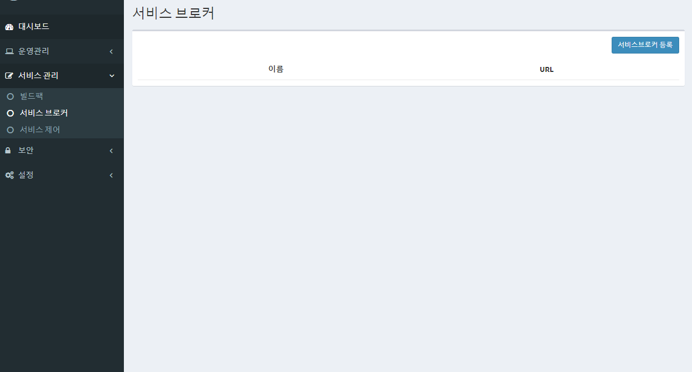

#### On-Demand-Redis 서비스 브로커를 등록한다.

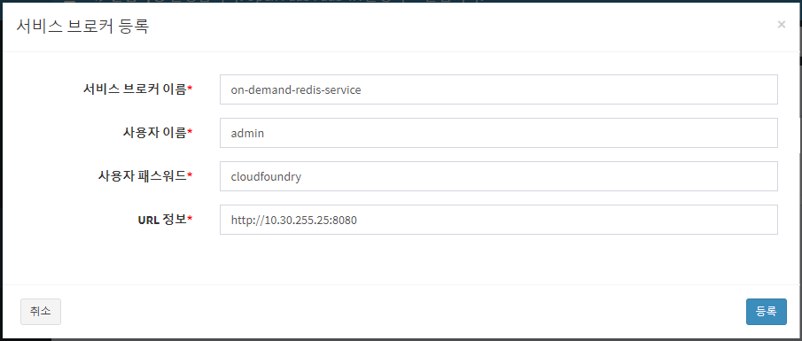 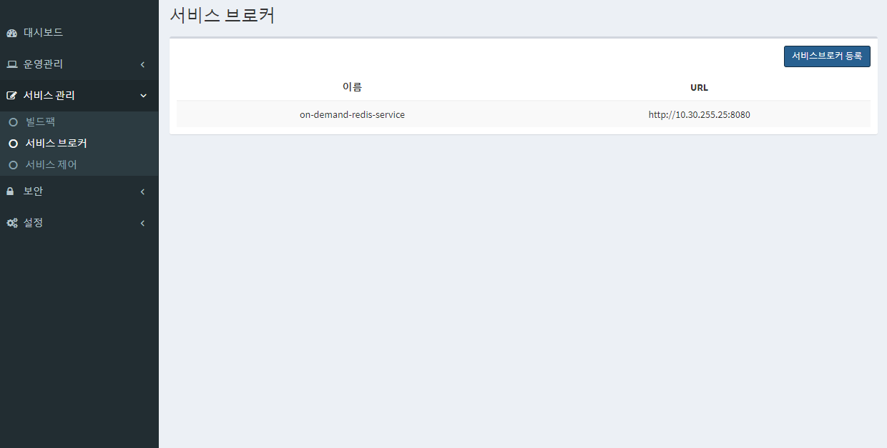

#### 등록된 On-Demand-Redis 서비스 브로커를 확인한다.

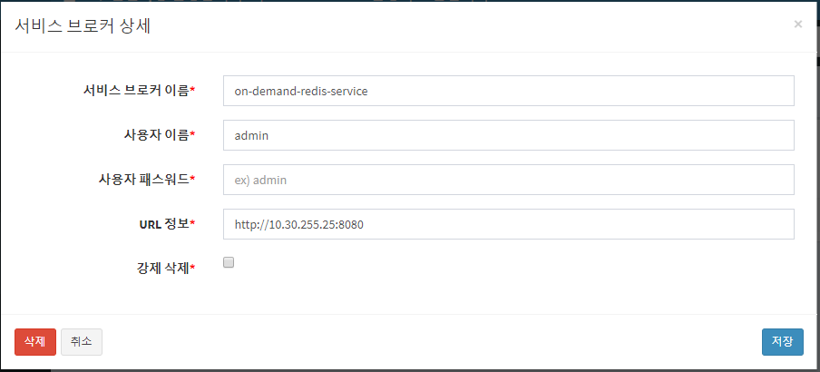

#### 서비스관리의 서비스 제어 페이지에서 접근 가능한 서비스 목록을 확인한다.

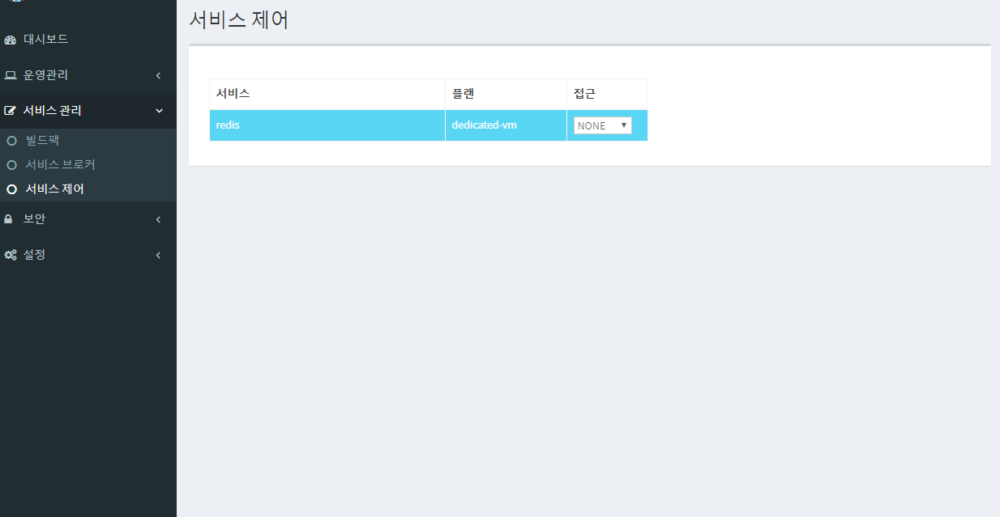

서비스 브로커 등록시 최초에는 접근을 허용하지 않는다. 따라서 access는 none으로 설정된다.

#### 특정 조직에 해당 서비스 접근 허용을 할당하고 접근 서비스 목록을 다시 확인한다. \(전체 조직\)

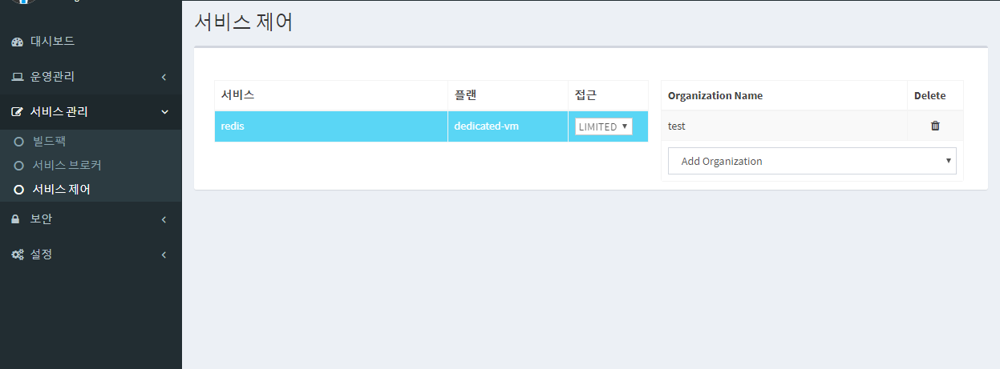

### 4.1. 서비스 신청

사용자 포탈에서 서비스 신청하기 위해서는 관리자 포탈의 카탈로그페이지에서 서비스 등록을 먼저 해주어야 사용이 가능하다.

#### 관리자 포탈의 운영관리의 카탈로그 페이지로 이동해 서비스 등록을 한다.

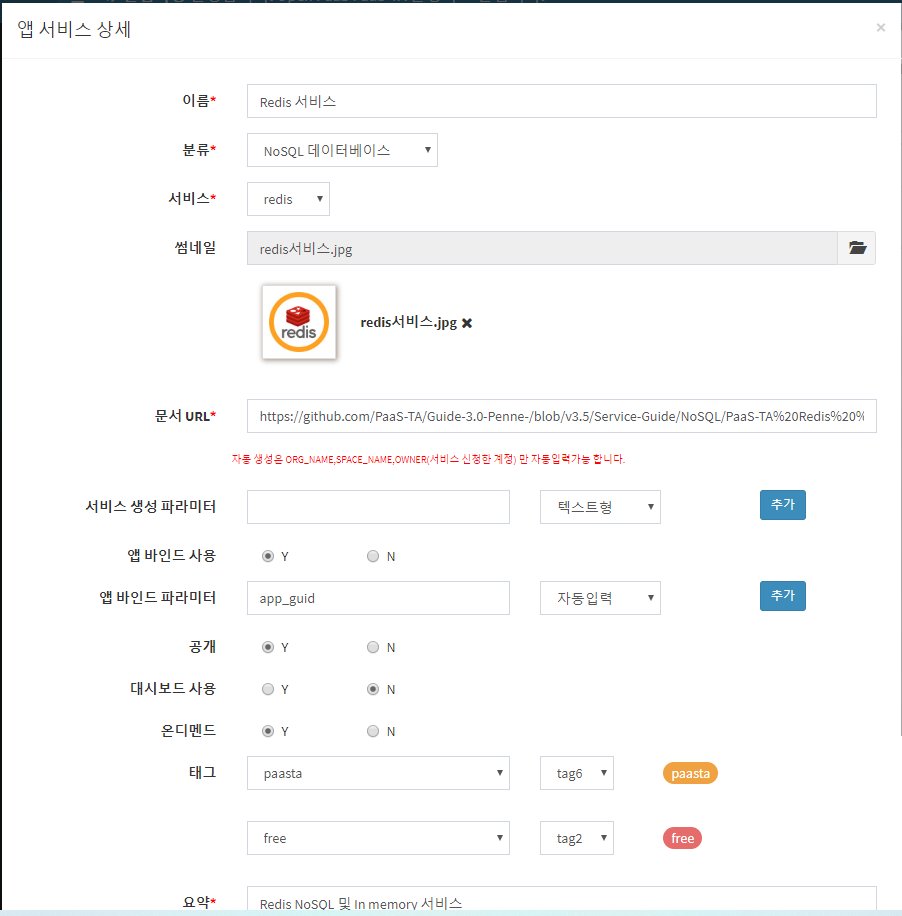 앱 바인드 파라미터는 app\_guid 자동입력을 추가, 온디멘드 Y 로 설정후 서비스 등록을 진행한다.

#### 사용자 포탈 로그인 후 카탈로그 페이지에서 서비스를 생성한다.

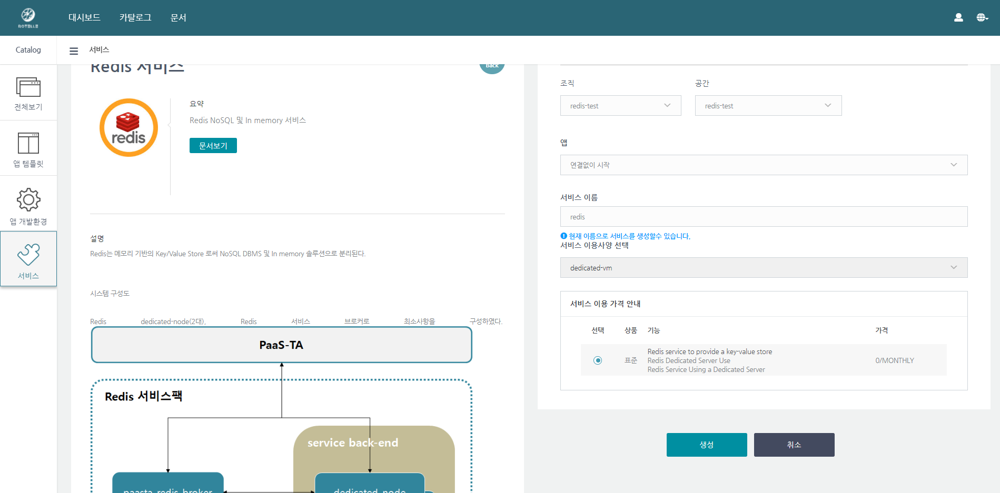

#### 생성된 Redis 서비스 인스턴스의 status를 확인한다.

Service status : in progress 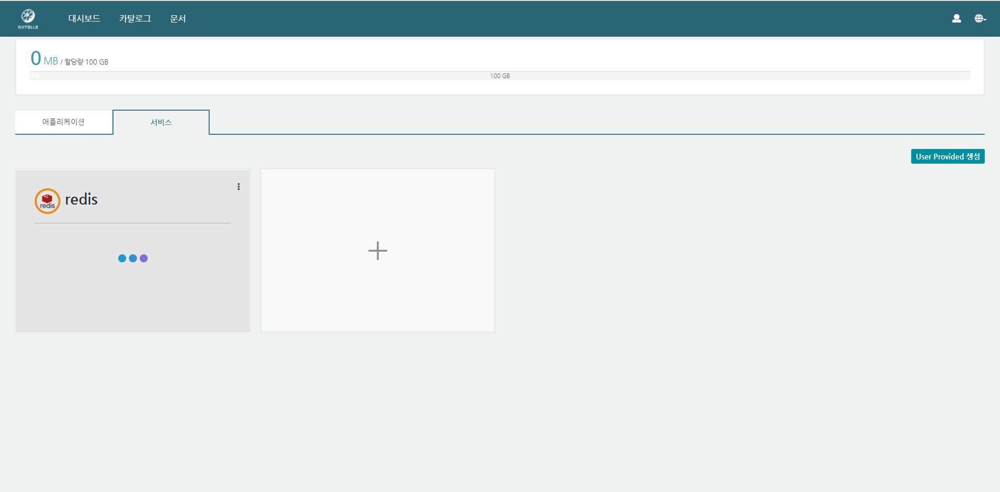

Service status : created succeed 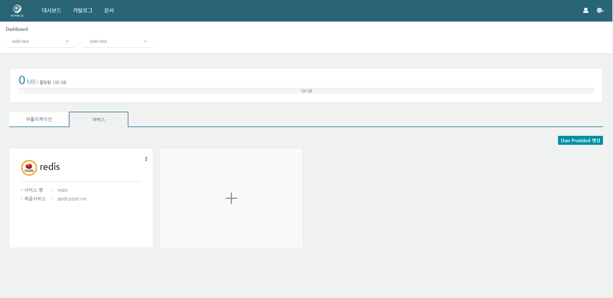

#### 관리자포탈 보안의 시큐리티그룹 페이지로 이동해 redis\_\[서비스 할당된 space guid\] 가 생성된것을 확인한다.

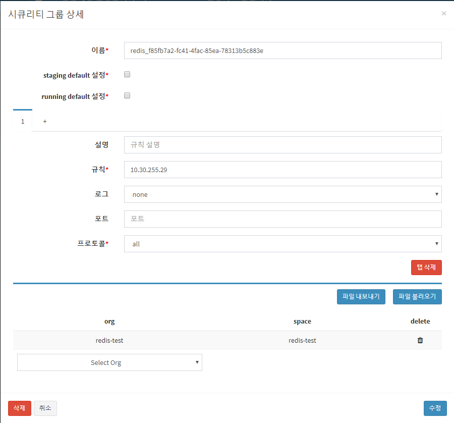

## 5. Redis Client 툴 접속

Application에 바인딩 된 Redis 서비스 연결정보는 Private IP로 구성되어 있기 때문에 Redis Client 툴에서 직접 연결할 수 없다. 따라서 Redis Client 툴에서 SSH 터널, Proxy 터널 등을 제공하는 툴을 사용해서 연결하여야 한다. 본 가이드는 SSH 터널을 이용하여 연결 하는 방법을 제공하며 Redis Client 툴로써는 오픈 소스인 Redis Desktop Manager로 가이드한다. Redis Desktop Manager 에서 접속하기 위해서 먼저 SSH 터널링할수 있는 VM 인스턴스를 생성해야한다. 이 인스턴스는 SSH로 접속이 가능해야 하고 접속 후 PaaS-TA에 설치한 서비스팩에 Private IP 와 해당 포트로 접근이 가능하도록 시큐리티 그룹을 구성해야 한다. 이 부분은 OpenStack 관리자 및 PaaS-TA 운영자에게 문의하여 구성한다. vsphere 에서 구성한 인스턴스는 공개키\(.pem\) 로 접속을 해야 하므로 공개키는 운영 담당자에게 문의하여 제공받는다. 참고\) 개인키\(.ppk\)로는 접속이 되지 않는다.

### 5.1. Redis Desktop Manager 설치 및 연결

Redis Desktop Manager 프로그램은 무료로 사용할 수 있는 오픈소스 소프트웨어이다.

#### Redis Desktop Manager를 다운로드 하기 위해 아래 URL로 이동하여 설치파일을 다운로드 한다.

[**http://redisdesktop.com/download**](http://redisdesktop.com/download) 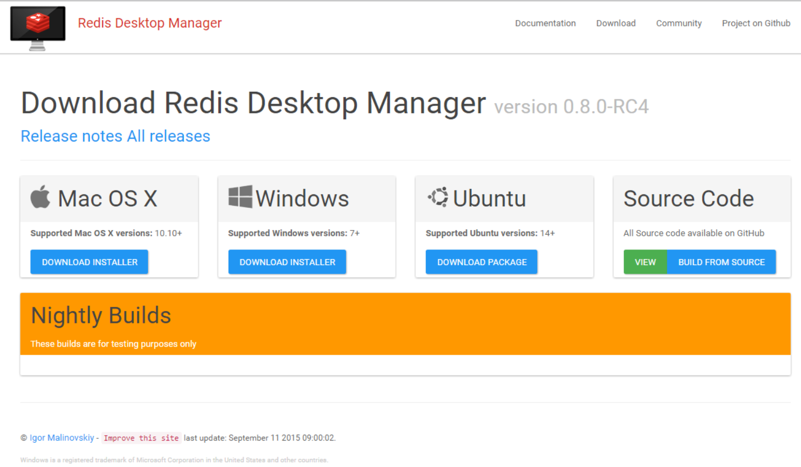

#### 다운로드한 설치파일을 실행한다.

> 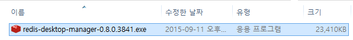

#### Redis Desktop Manager 설치를 위한 안내사항이다. Next 버튼을 클릭한다.

> 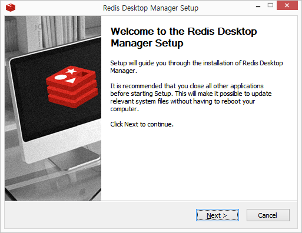

#### 프로그램 라이선스에 관련된 내용이다. I Agree 버튼을 클릭한다.

> 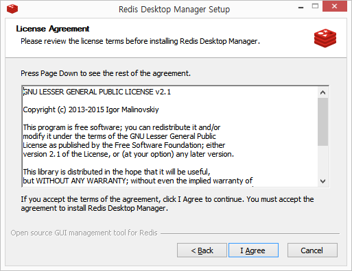

#### Redis Desktop Manager를 설치할 경로를 설정 후 Install 버튼을 클릭한다.

별도의 경로 설정이 필요 없을 경우 default로 C드라이브 Program Files 폴더에 설치가 된다.

> 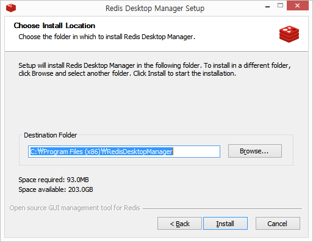

#### 설치 완료 후 Next 버튼을 클릭하여 다음 과정을 진행한다.

> 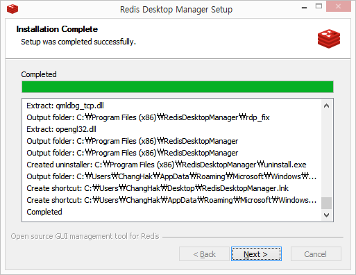

#### Finish 버튼 클릭으로 설치를 완료한다.

> 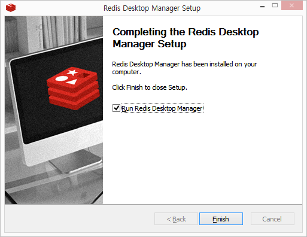

#### Redis Desktop Manager를 실행했을 때 처음 뜨는 화면이다. 이 화면에서 Server에 접속하기 위한 profile을 설정/저장하여 접속할 수 있다. Connect to Redis Server 버튼을 클릭한다.

> 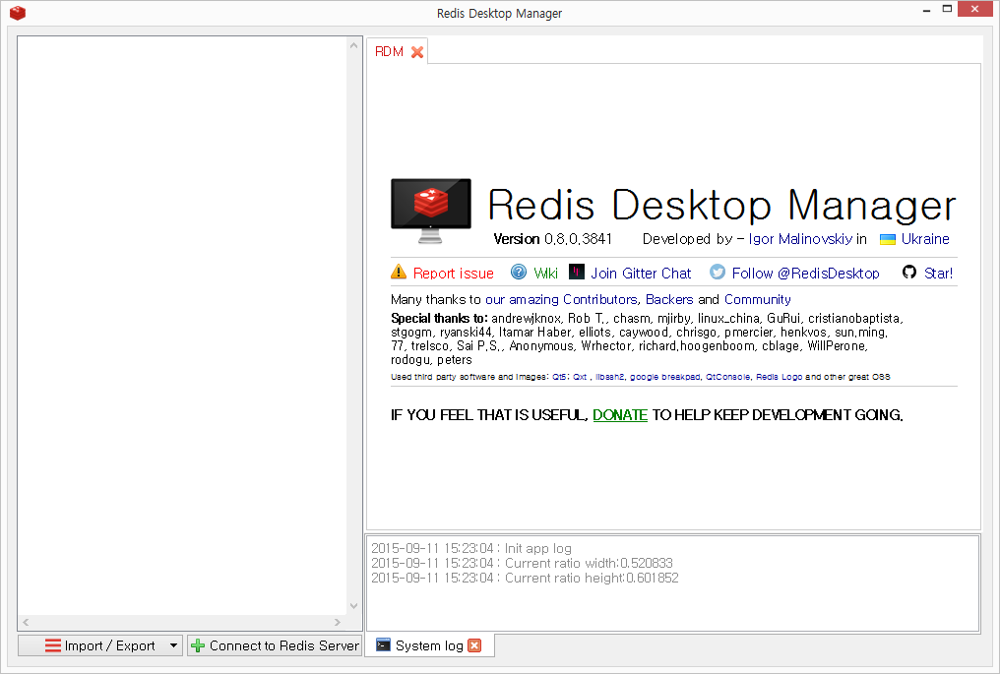

#### Connection 탭에서 아래 붉은색 영역에 접속하려는 서버 정보를 모두 입력한다.

> 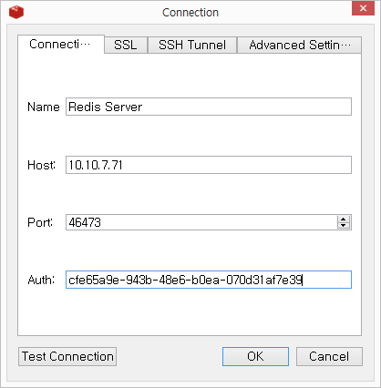

#### 서버 정보는 Application에 바인드 되어 있는 서버 정보를 입력한다. cfenv 명령어로 이용하여 확인한다.

예\) $ cfenvredis-example-app

> 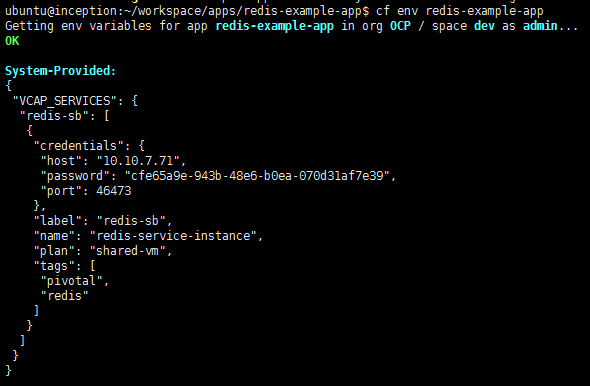

#### SSH Tunnel탭을 클릭하고 PaaS-TA 운영 관리자에게 제공받은 SSH 터널링 가능한 서버 정보를 입력하고 공개키\(.pem\) 파일을 불러온다. Test Connection 버튼을 클릭하면 Redis 서버에 접속이 되는지 테스트 하고 OK 버튼을 눌러 Redis 서버에 접속한다.

\(참고\) 만일 공개키 없이 ID/Password로 접속이 가능한 경우에는 공개키 대신 사용자 이름과 암호를 입력한다.

> 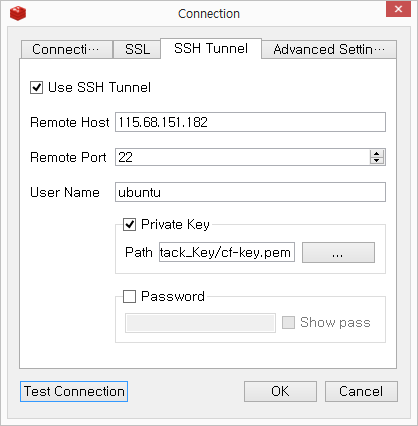

#### 접속이 완료되고 좌측 서버 정보를 더블 클릭하면 좌측에 스키마 정보가 나타난다.

> 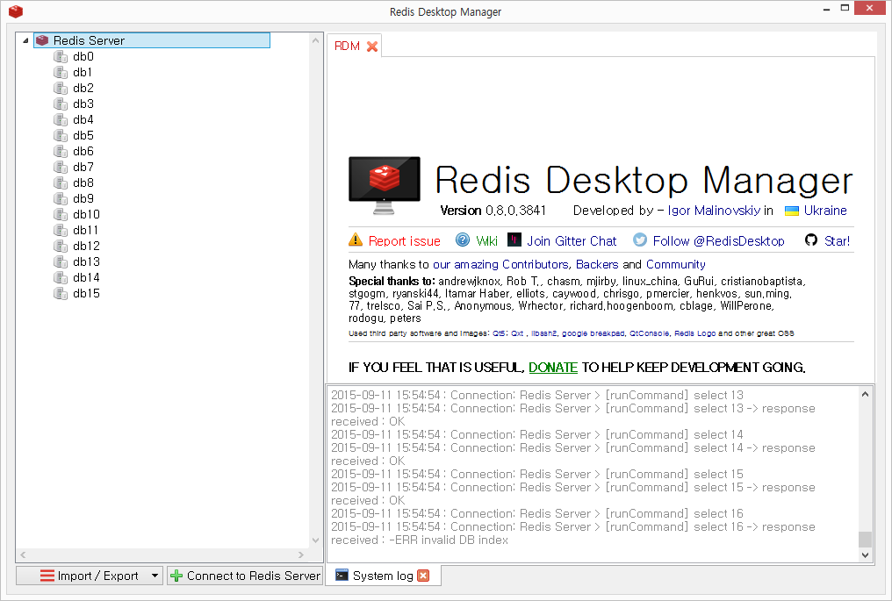

#### 신규 키 등록후 확인

> 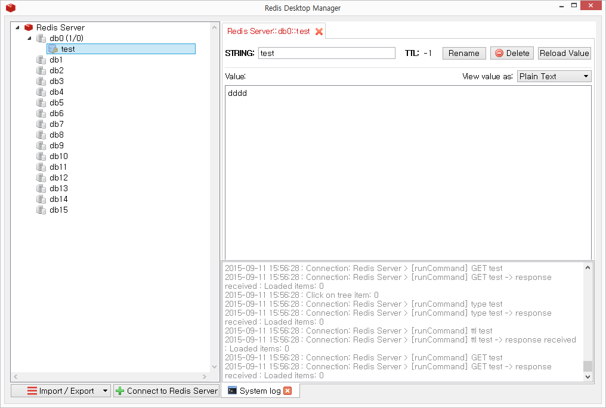

