# PAAS-TA\_MARKETPLACE\_USE\_GUIDE\_V1.0

## \[PaaS-TA 마켓플레이스 가이드\]

### 목차

1. [문서 개요](paas-ta_marketplace_use_guide_v1.0.md#1)
   * [1.1. 목적](paas-ta_marketplace_use_guide_v1.0.md#1-1)
   * [1.2. 범위](paas-ta_marketplace_use_guide_v1.0.md#1-2)
2. [마켓플레이스 접속](paas-ta_marketplace_use_guide_v1.0.md#2)
   * [2.1. 마켓플레이스 계정 생성](paas-ta_marketplace_use_guide_v1.0.md#2-1)
   * [2.2. 마켓플레이스 로그인](paas-ta_marketplace_use_guide_v1.0.md#2-2)
3. [마켓플레이스 매뉴얼](paas-ta_marketplace_use_guide_v1.0.md#3)
   * [3.1. 마켓플레이스 메뉴 구성](paas-ta_marketplace_use_guide_v1.0.md#3-1)
   * [3.2. 사용자 마켓플레이스](paas-ta_marketplace_use_guide_v1.0.md#3-2)
   * [3.2.1. 상품 목록](paas-ta_marketplace_use_guide_v1.0.md#3-2-1)
   * [3.2.1.1. 상품 목록 검색 조회](paas-ta_marketplace_use_guide_v1.0.md#3-2-1-1)
   * [3.2.1.2. 상품 상세 조회 및 구매](paas-ta_marketplace_use_guide_v1.0.md#3-2-1-2)
   * [3.2.2. 마이 페이지](paas-ta_marketplace_use_guide_v1.0.md#3-2-2)
   * [3.2.2.1. 사용 상품](paas-ta_marketplace_use_guide_v1.0.md#3-2-2-1)
   * [3.2.2.1.1 사용 상품 검색 조회](paas-ta_marketplace_use_guide_v1.0.md#3-2-2-1-1)
   * [3.2.2.1.2 사용 상품 상세 조회 및 사용 중지](paas-ta_marketplace_use_guide_v1.0.md#3-2-2-1-2)
   * [3.2.2.2. 요금 계산](paas-ta_marketplace_use_guide_v1.0.md#3-2-2-2)
   * [3.2.2.3. 요금 통계](paas-ta_marketplace_use_guide_v1.0.md#3-2-2-3)
   * [3.2.2.4. 장바구니](paas-ta_marketplace_use_guide_v1.0.md#3-2-2-4)
   * [3.3. 판매자 마켓플레이스](paas-ta_marketplace_use_guide_v1.0.md#3-3)
   * [3.3.1. 등록 상품](paas-ta_marketplace_use_guide_v1.0.md#3-3-1)
   * [3.3.1.1. 상품 목록](paas-ta_marketplace_use_guide_v1.0.md#3-3-1-1)
   * [3.3.1.1.1. 상품 목록 검색 조회](paas-ta_marketplace_use_guide_v1.0.md#3-3-1-1-1)
   * [3.3.1.1.2. 상품 상세 조회 및 수정](paas-ta_marketplace_use_guide_v1.0.md#3-3-1-1-2)
   * [3.3.1.2. 상품 등록](paas-ta_marketplace_use_guide_v1.0.md#3-3-1-2)
   * [3.3.2. 사용 현황](paas-ta_marketplace_use_guide_v1.0.md#3-3-2)
   * [3.3.2.1. 상품 현황](paas-ta_marketplace_use_guide_v1.0.md#3-3-2-1)
   * [3.3.2.1.1. 상품 사용 현황](paas-ta_marketplace_use_guide_v1.0.md#3-3-2-1-1)
   * [3.3.2.1.2. 상품 현황 상세](paas-ta_marketplace_use_guide_v1.0.md#3-3-2-1-2)
   * [3.3.2.2. 요금 통계](paas-ta_marketplace_use_guide_v1.0.md#3-3-2-2)
   * [3.3.3.   프로필 관리](paas-ta_marketplace_use_guide_v1.0.md#3-3-3)
   * [3.3.3.1. 프로필 등록](paas-ta_marketplace_use_guide_v1.0.md#3-3-3-1)
   * [3.3.3.2. 프로필 상세](paas-ta_marketplace_use_guide_v1.0.md#3-3-3-2)
   * [3.3.3.3. 프로필 수정](paas-ta_marketplace_use_guide_v1.0.md#3-3-3-3)
   * [3.4.     관리자 마켓플레이스](paas-ta_marketplace_use_guide_v1.0.md#3-4)
   * [3.4.1.   상품 관리](paas-ta_marketplace_use_guide_v1.0.md#3-4-1)
   * [3.4.1.1. 상품 목록 검색 조회](paas-ta_marketplace_use_guide_v1.0.md#3-4-1-1)
   * [3.4.1.2. 상품 상세 조회 및 수정](paas-ta_marketplace_use_guide_v1.0.md#3-4-1-2)
   * [3.4.2.   카테고리 관리](paas-ta_marketplace_use_guide_v1.0.md#3-4-2)
   * [3.4.2.1. 카테고리 조회](paas-ta_marketplace_use_guide_v1.0.md#3-4-2-1)
   * [3.4.2.2. 카테고리 수정 및 삭제](paas-ta_marketplace_use_guide_v1.0.md#3-4-2-2)
   * [3.4.2.3. 카테고리 추가](paas-ta_marketplace_use_guide_v1.0.md#3-4-2-3)
   * [3.4.3.   사용 현황](paas-ta_marketplace_use_guide_v1.0.md#3-4-3)
   * [3.4.3.1. 상품별 현황](paas-ta_marketplace_use_guide_v1.0.md#3-4-3-1)
   * [3.4.3.1.1. 상품별 현황 조회](paas-ta_marketplace_use_guide_v1.0.md#3-4-3-1-1)
   * [3.4.3.1.2. 상품별 현황 상세](paas-ta_marketplace_use_guide_v1.0.md#3-4-3-1-2)
   * [3.4.3.2. 판매자별 현황](paas-ta_marketplace_use_guide_v1.0.md#3-4-3-2)
   * [3.4.3.2.1. 판매자별 현황 조회](paas-ta_marketplace_use_guide_v1.0.md#3-4-3-2-1)
   * [3.4.3.2.2. 판매자별 현황 상세](paas-ta_marketplace_use_guide_v1.0.md#3-4-3-2-2)
   * [3.4.3.3. 사용자별 현황](paas-ta_marketplace_use_guide_v1.0.md#3-4-3-3)
   * [3.4.3.3.1. 사용자별 현황 조회](paas-ta_marketplace_use_guide_v1.0.md#3-4-3-3-1)
   * [3.4.3.3.2. 사용자별 현황 상세](paas-ta_marketplace_use_guide_v1.0.md#3-4-3-3-2)
   * [3.4.4.   판매자 관리](paas-ta_marketplace_use_guide_v1.0.md#3-4-4)
   * [3.4.4.1. 판매자 목록 조회](paas-ta_marketplace_use_guide_v1.0.md#3-4-4-1)
   * [3.4.4.2. 판매자 프로필 상세 및 수정](paas-ta_marketplace_use_guide_v1.0.md#3-4-4-2)

## 1. 문서 개요

### 1.1. 목적

본 문서는 마켓플레이스 서비스를 사용할 사용자, 판매자, 관리자 역할로서의 사용 방법에 대해 기술하였다.   

### 1.2. 범위

본 문서는 Windows 환경을 기준으로 마켓플레이스 서비스의 사용 방법에 대해 작성되었다. 아래 차트는 마켓플레이스 전체 프로세스의 흐름에 대한 주요 흐름을 표현하고 있다. 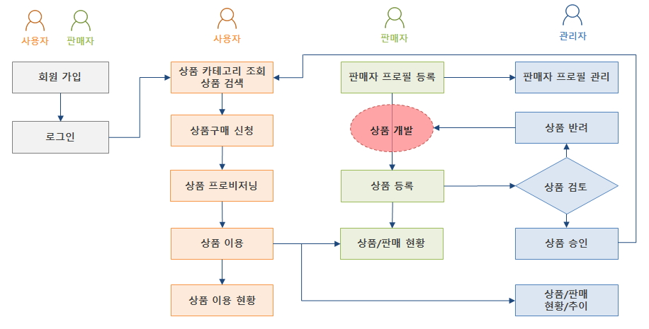   

## 2. 마켓플레이스 접속

### 2.1. 마켓플레이스 계정 생성

_**※ PaaS-TA 사용자 포탈 계정 생성 가이드**_  
[https://github.com/PaaS-TA/Guide-4.0-ROTELLE/blob/master/Use-Guide/portal/PaaS-TA %EC%82%AC%EC%9A%A9%EC%9E%90 %ED%8F%AC%ED%83%88 %EA%B0%80%EC%9D%B4%EB%93%9C\_v1.1.md\#4](https://github.com/PaaS-TA/Guide-4.0-ROTELLE/blob/master/Use-Guide/portal/PaaS-TA%20%EC%82%AC%EC%9A%A9%EC%9E%90%20%ED%8F%AC%ED%83%88%20%EA%B0%80%EC%9D%B4%EB%93%9C_v1.1.md#4)   

### 2.2. 마켓플레이스 로그인

> **PaaS-TA 사용자 포탈** 1. PaaS-TA 사용자 포탈에서 로그인한다. 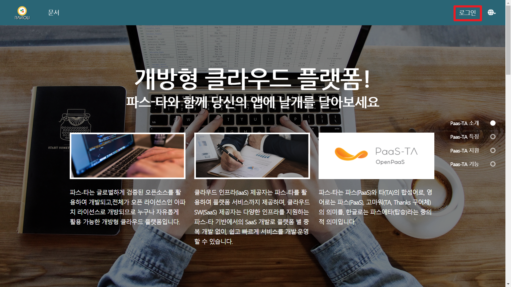

1. Dashboard에서 항목을 선택하여 이동한다.

   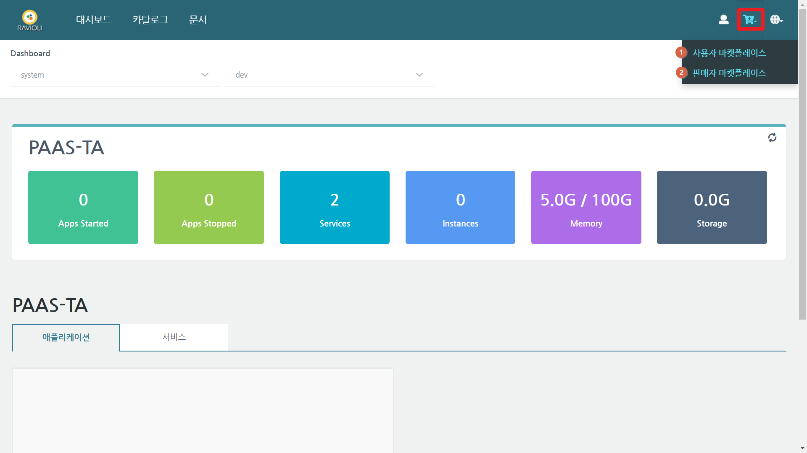

   2-1. 사용자 마켓플레이스로 이동한다.  

   2-2. 판매자 마켓플레이스로 이동한다.

> **PaaS-TA 운영자 포탈** 1. PaaS-TA 운영자 포탈에서 로그인한다. 

1. 메뉴의 "마켓플레이스" 버튼을 클릭하여 관리자 마켓플레이스로 이동한다.

   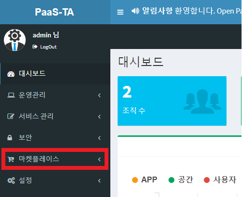

## 3. 마켓플레이스 매뉴얼

본 장에서는 마켓플레이스의 메뉴 구성 및 화면에 대해서 기술하였다.   

### 3.1. 마켓플레이스 메뉴 구성

마켓플레이스 서비스는 사용자, 판매자, 관리자로 구성되어 있다. 

| 메뉴 | 분류 | 설명 |
| :--- | :--- | :--- |

| 사용자 마켓플레이스 | 상품 목록 | 등록된 상품 조회, 검색 및 구매 |
| :--- | :--- | :--- |

| 마이 페이지 | 사용자가 구매한 상품 내역 및 요금 관리 |
| :--- | :--- |

| 판매자 마켓플레이스 | 등록 상품 | 상품 등록 및 관리 |
| :--- | :--- | :--- |

| 사용 현황 | 판매자가 등록한 상품 현황 관리 |
| :--- | :--- |

| 프로필 관리 | 판매자 프로필 관리 |
| :--- | :--- |

| 관리자 마켓플레이스 | 상품 관리 | 전체 상품 조회, 검색 및 관리 |
| :--- | :--- | :--- |

| 카테고리 관리 | 전체 카테고리 관리 |
| :--- | :--- |

| 사용 현황 | 상품별, 판매자별, 사용자별 현황 관리 |
| :--- | :--- |

| 판매자 관리 | 판매자 등록 관리 |
| :--- | :--- |

### 3.2. 사용자 마켓플레이스

사용자 마켓플레이스는 상품 구매를 위한 메뉴로 본 장에서는 등록된 상품을 이용하는 사용자들의 상품 구매 및 정보 조회와 요금 관리에 대한 설명을 기술한다.

| 분류 | 기능 | 설명 |
| :--- | :--- | :--- |

| 상품 목록 | 상품 관리 | 판매자가 등록한 상품을 조건에 따라 검색 |
| :--- | :--- | :--- |

| 판매자가 등록한 상품 목록 조회, 선택한 상품의 상세정보 조회 |
| :--- |

| 구매 | 판매자가 등록한 상품 구매 |
| :--- | :--- |

| 판매자가 등록한 상품 장바구니에 추가 |
| :--- |

| 마이페이지 | 사용 상품 | 사용 중인 상품 목록 조회 |
| :--- | :--- | :--- |

| 사용 중인 상품의 접속 URL로 연결 |
| :--- |

| 사용 중인 상품을 사용중지 |
| :--- |

| 요금 정보 | 상품의 요금정책에 따른 요금정보 조회 |
| :--- | :--- |

#### 3.2.1. 상품 목록

**3.2.1.1. 상품 목록 검색 조회**

* 등록된 상품 목록을 조회할 수 있다.
* 카테고리, 상품명으로 검색할 수 있다.

  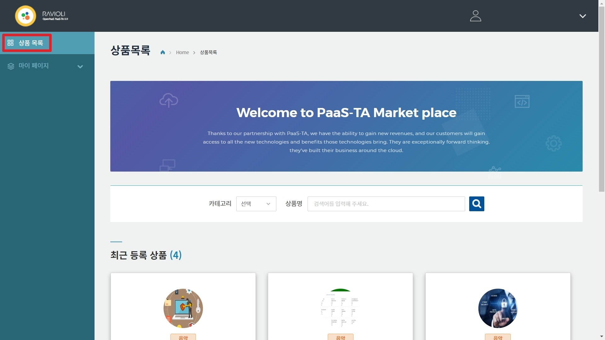

**3.2.1.2. 상품 상세 조회 및 구매**

1. 상품 목록에서 항목을 선택하여 상품 상세 조회 페이지로 이동한다. 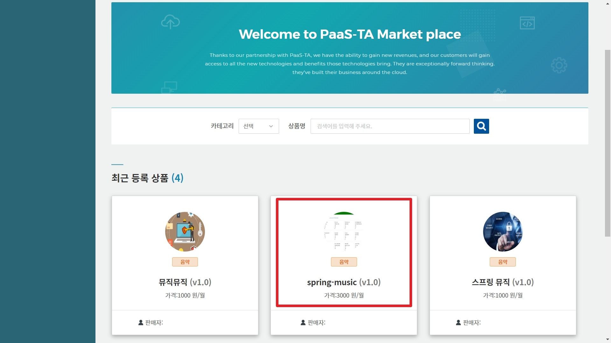  
2. "구매하기" 버튼을 클릭한다. 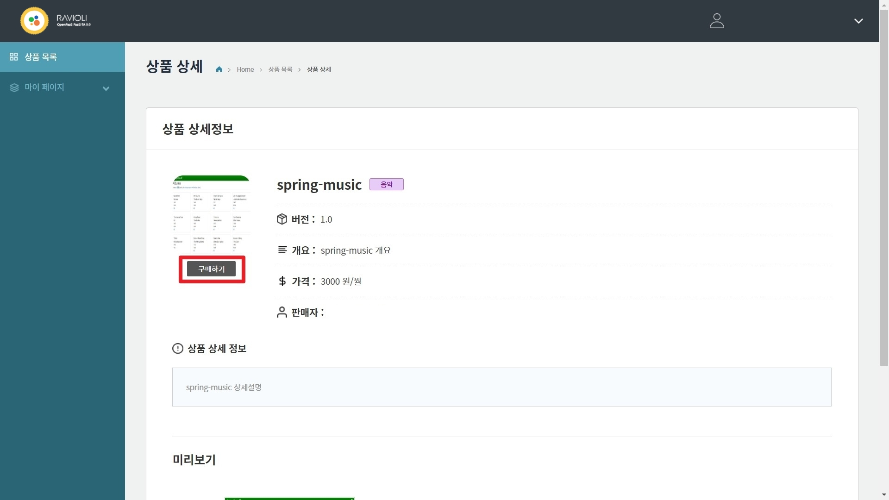  
3. 구매하거나 장비구니에 추가한다.

3.1. "구매"버튼을 클릭하여 상품을 구매한다.  
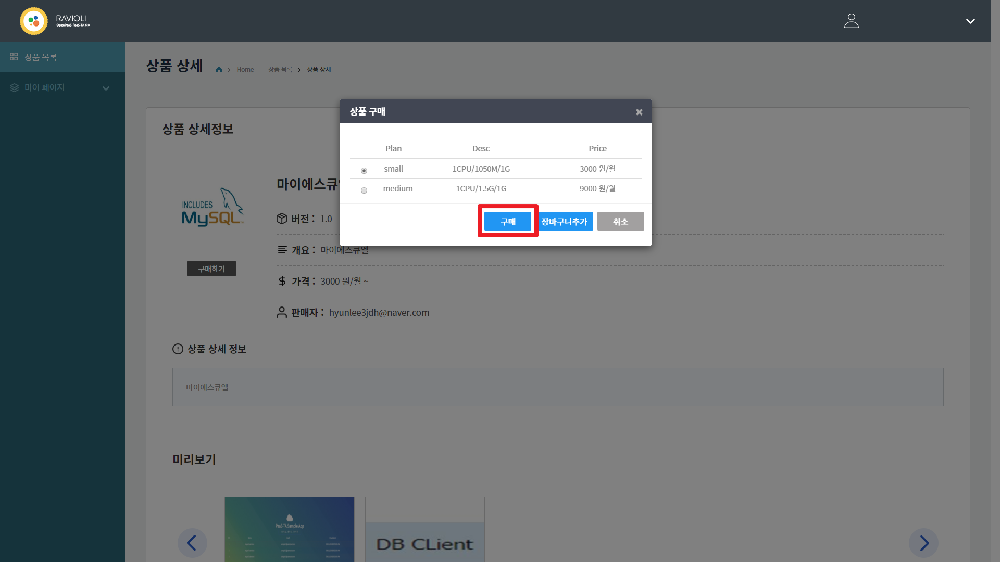   

3.2. "장바구니추가"버튼을 클릭하여 상품을 장바구니에 추가한다. 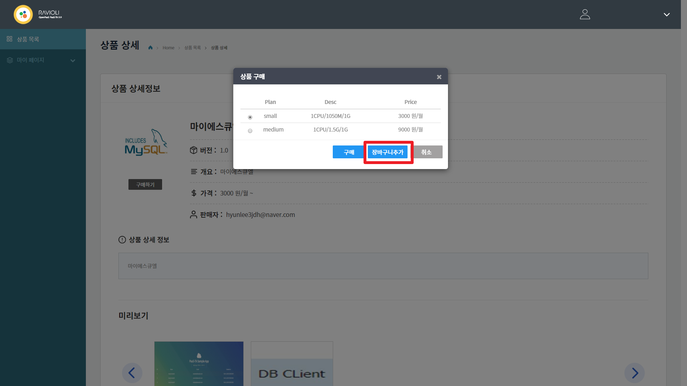   
  

#### 3.2.2. 마이 페이지

**3.2.2.1. 사용 상품**

**3.2.2.1.1. 사용 상품 검색 조회**

* 구매한 상품 목록을 조회할 수 있다.
* 카테고리, 상품명으로 검색할 수 있다.

  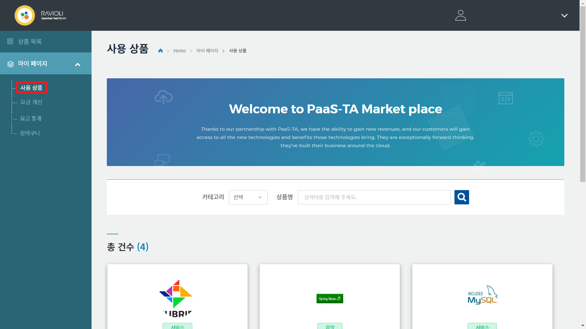

**3.2.2.1.2. 사용 상품 상세 조회 및 사용 중지**

1. 구매한 상품 목록에서 항목을 선택하여 상품 상세 조회 페이지로 이동한다. 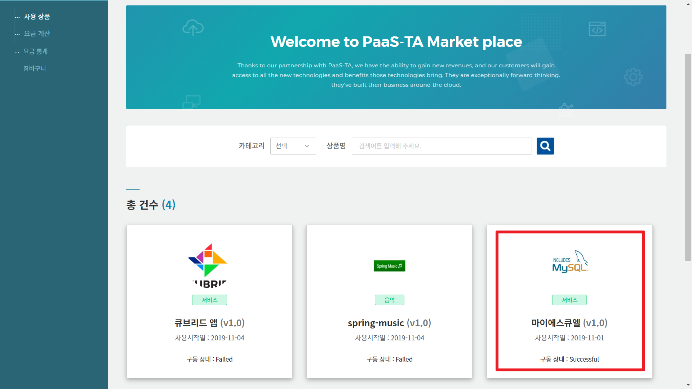  
2. ①"접속 URL 연결" 버튼을 클릭하여 해당 URL로 이동하거나 ②"정지" 버튼을 클릭하여 사용을 중단한다. 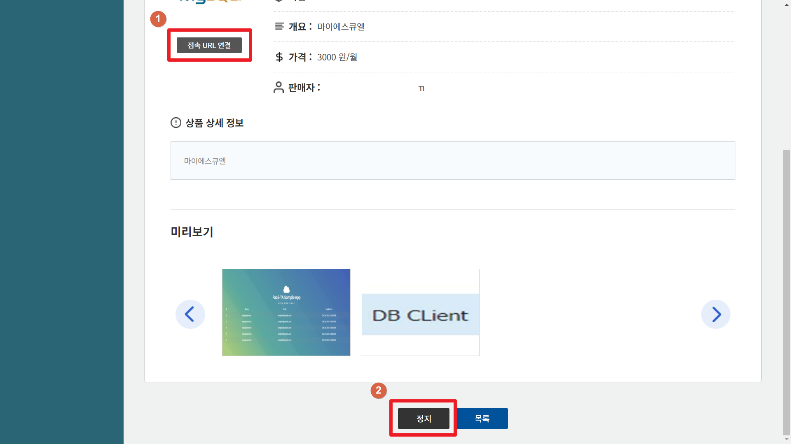  
3. 만약 구매한 상품이 정상 작동 되지 않은 상태에서 사용을 중단하려면 "강제정지" 버튼을 클릭한다. 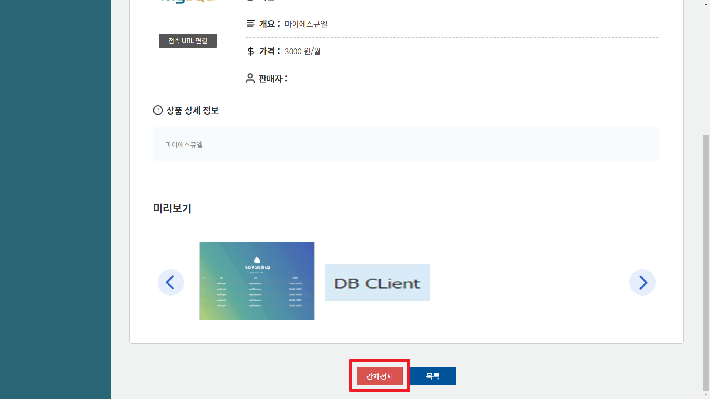  

**3.2.2.2. 요금 계산**

* 사용 기간, 카테고리, 상품명으로 구매한 내역을 검색할 수 있다. 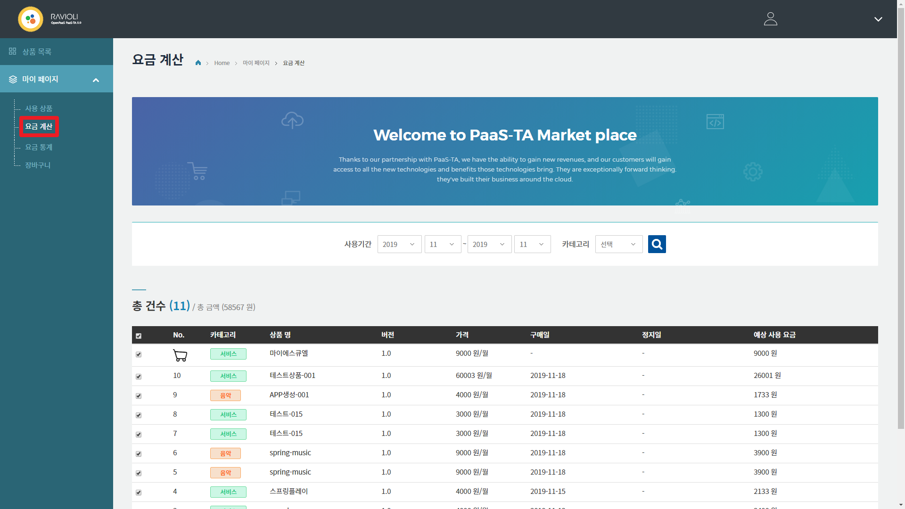  
* ①장바구니 포함 체크박스, ②구매항목별 체크박스의 선택 여부에 따라 ③총 예상 사용 금액을 계산할 수 있다. 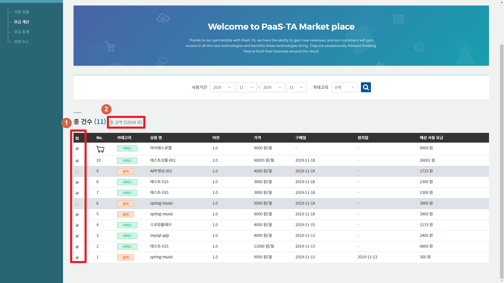   

  **3.2.2.3. 요금 통계**

* 사용기간으로 월별 요금 통계 정보를 검색할 수 있다. 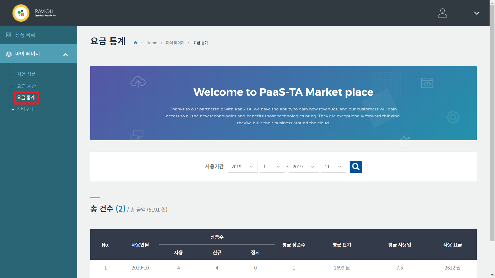   

  **3.2.2.4. 장바구니**

* 저장기간, 카테고리, 상품명으로 장바구니 목록을 검색할 수 있다. 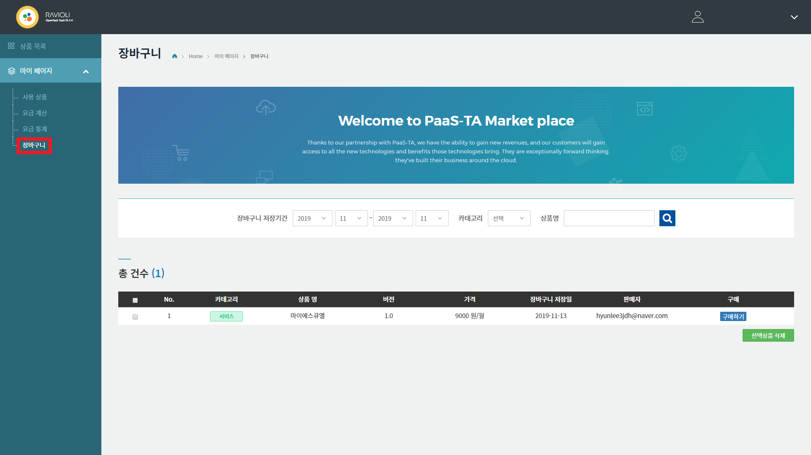  
* ①장바구니 항목별 체크박스의 선택 여부에 따라 ②구매 혹은 ③삭제 할 수 있다. 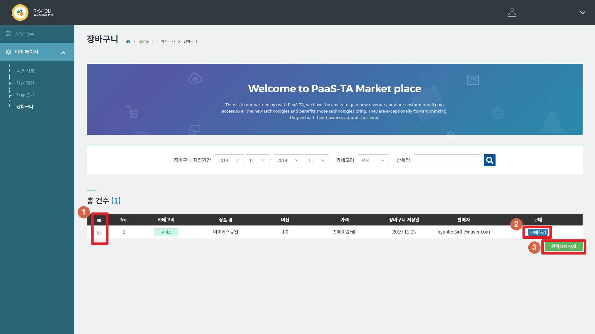   

### 3.3. 판매자 마켓플레이스

판매자 마켓플레이스는 상품 판매를 위한 메뉴로서 본 장에서는 상품을 판매하는 판매자들의 상품 등록 및 현황 조회와 요금 관리, 판매자 프로필 관리에 대한 설명을 기술한다.

| 분류 | 기능 | 설명 |
| :--- | :--- | :--- |

| 등록 상품 | 상품 관리 | 등록한 상품 목록 및 선택한 상품의 상세정보 조회 |
| :--- | :--- | :--- |

| 상품을 등록, 변경 |
| :--- |

| 요금 관리 | 상품의 요금 정보 관리 |
| :--- | :--- |

| 사용 현황 | 상품 현황 | 판매자가 등록한 상품별 실시간 사용량 조회 |
| :--- | :--- | :--- |

| 판매자의 상품을 구매한 사용자 목록 조회 |
| :--- |

| 판매자의 상품별 사용자 추이 조회 |
| :--- |

| 요금 정보 | 판매된 상품의 사용 요금 조회 |
| :--- | :--- |

| 프로필 관리 | 프로필 관리 | 판매자 프로필 정보 등록, 변경 |
| :--- | :--- | :--- |

#### 3.3.1. 등록 상품

**3.3.1.1. 상품 목록**

**3.3.1.1.1. 상품 목록 검색 조회**

* 등록한 상품 목록을 조회할 수 있다.
* 등록일/승인일\(반려일\), 카테고리, 승인상태, 전시여부, 상품명으로 검색할 수 있다.

  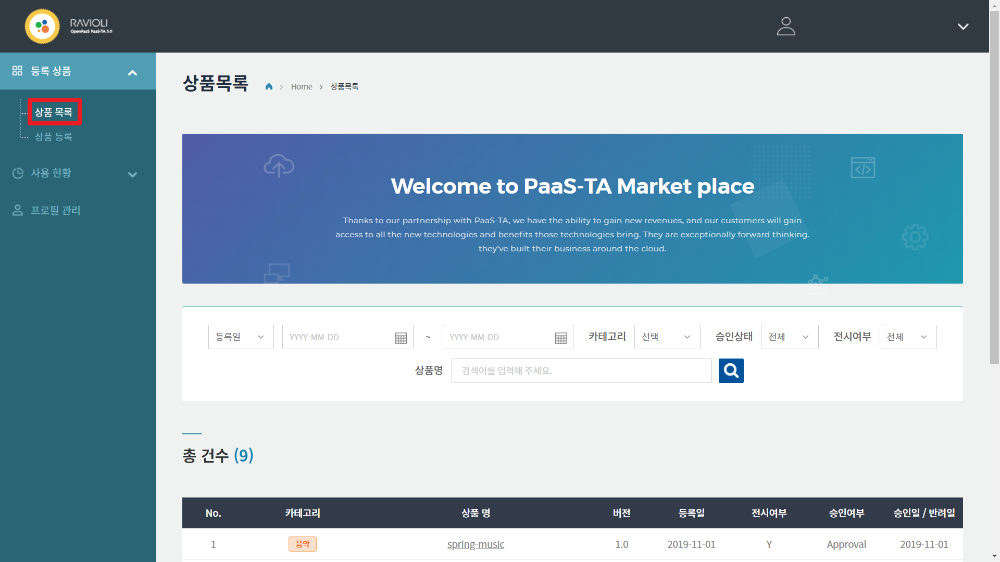

**3.3.1.1.2. 상품 상세 조회 및 수정**

1. 등록한 상품 목록에서 항목을 선택하여 상품 상세 조회 페이지로 이동한다. 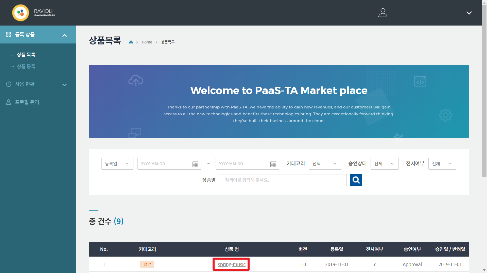  
2. 상세 정보 확인 후 "수정" 버튼을 클릭하여 상품 정보 수정 페이지로 이동한다. 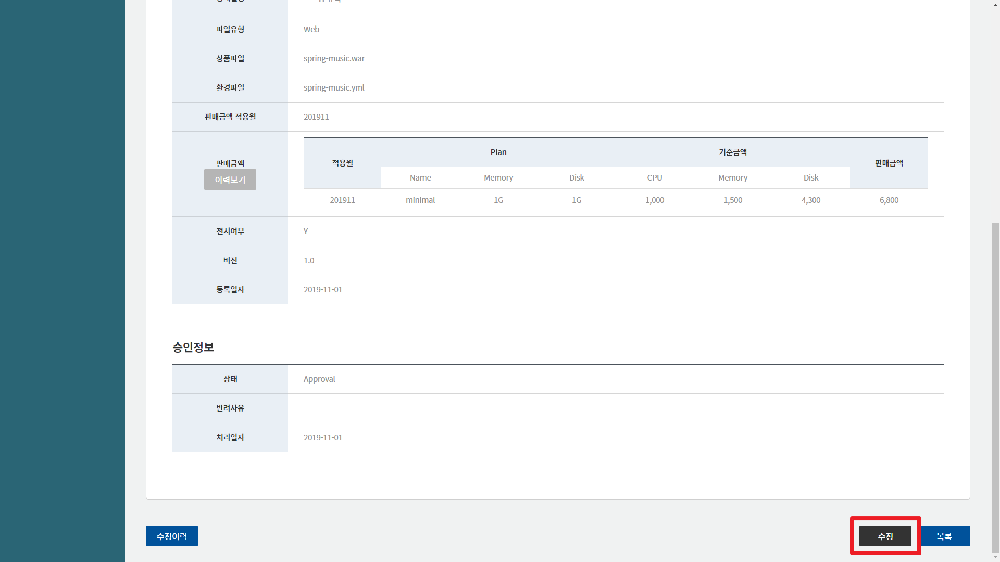  
3. 항목을 수정하여 "저장" 버튼을 클릭한다. 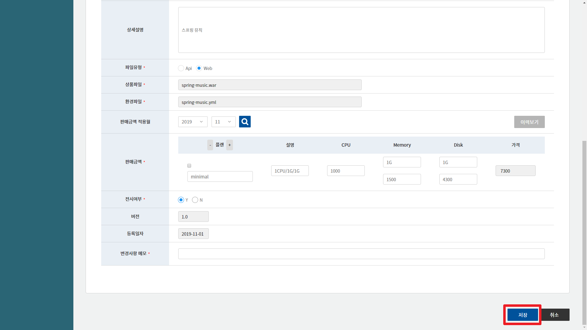  
4. "수정이력" 버튼을 클릭하여 수정이력을 확인할 수 있다. 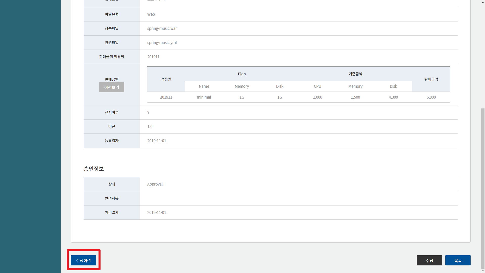  

**3.3.1.2. 상품 등록**

* 신규 상품을 등록할 수 있다.

  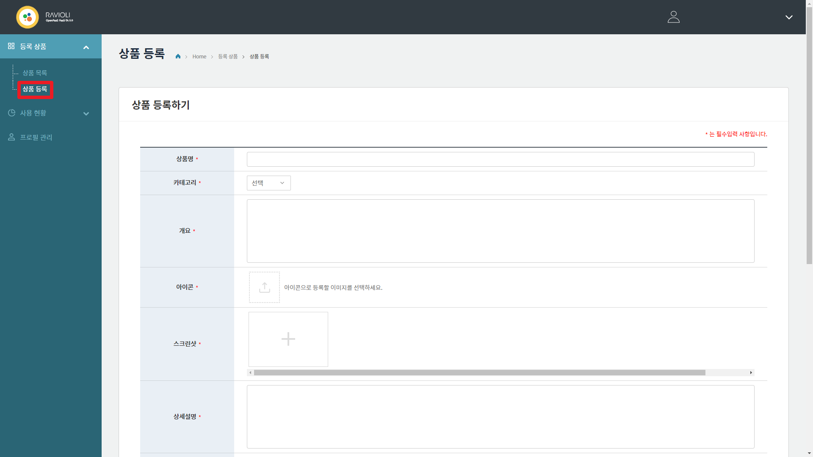

#### 3.3.2. 사용 현황

**3.3.2.1. 상품 현황**

**3.3.2.1.1. 상품 사용 현황**

* 등록한 상품의 목록과 판매 현황을 확인할 수 있다.
* 등록일/승인일, 카테고리로 검색할 수 있다.

  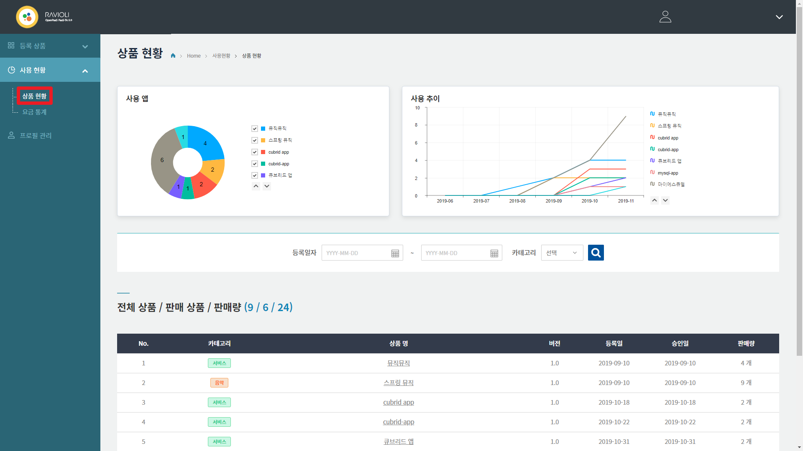

**3.3.2.1.2. 상품 현황 상세**

1. 등록한 상품 목록에서 항목을 선택하여 상품 상세 조회 페이지로 이동한다. 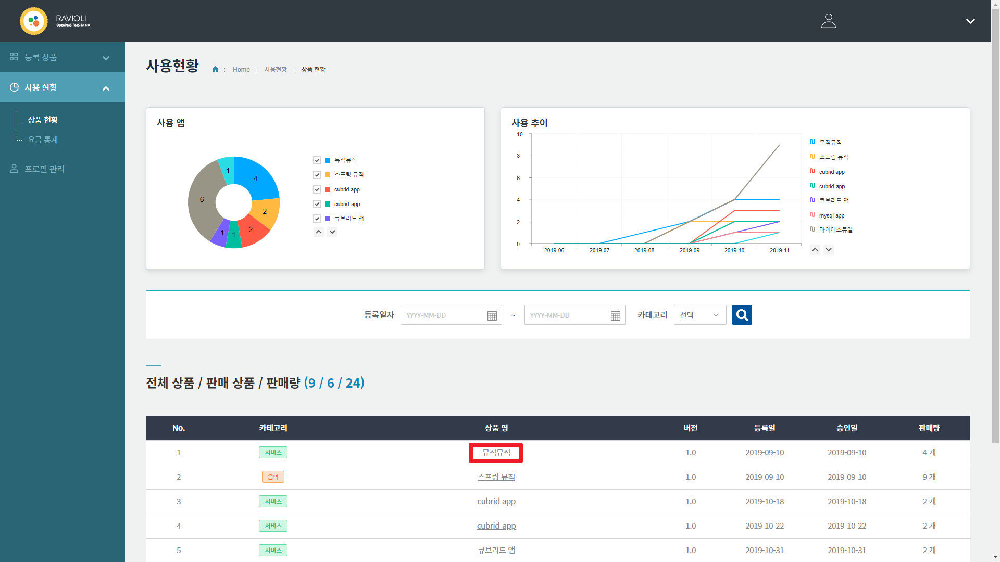  
2. 현재 기준 상품 현황과 사용자 추이, 개별 판매 목록을 확인한다. 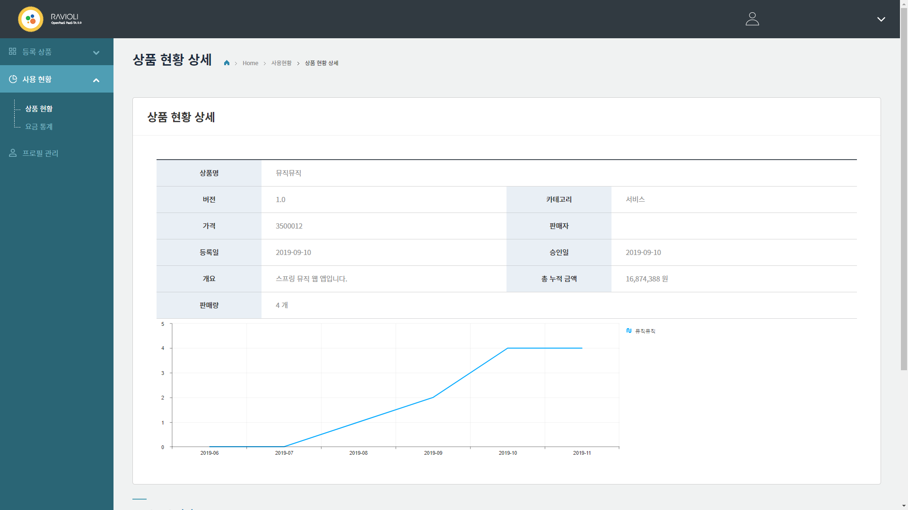  

**3.3.2.2. 요금 통계**

* 등록한 상품의 목록과 요금 현황을 확인할 수 있다.
* 사용연월, 카테고리로 검색할 수 있다.

  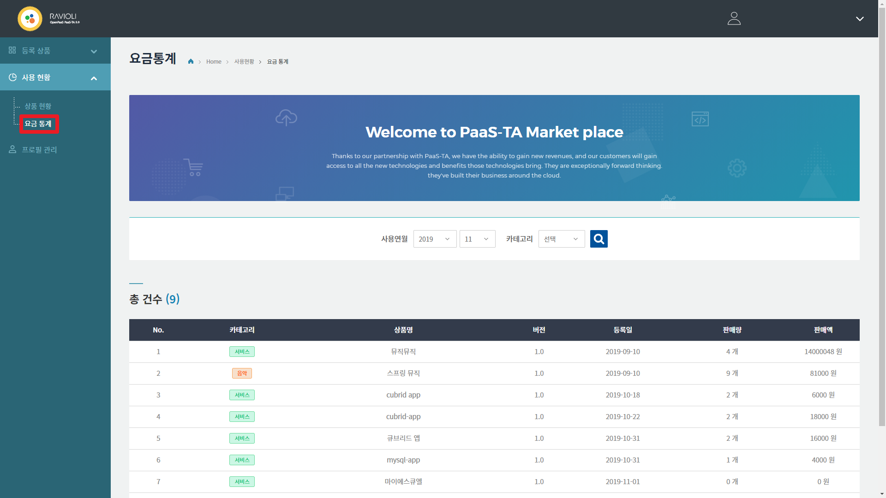

#### 3.3.3. 프로필 관리

_**※ 미등록 판매자는 프로필 등록 페이지, 기등록 판매자는 프로필 상세 페이지로 이동한다.**_

**3.3.3.1. 프로필 등록**

* 미등록한 판매자의 프로필을 등록할 수 있다.

  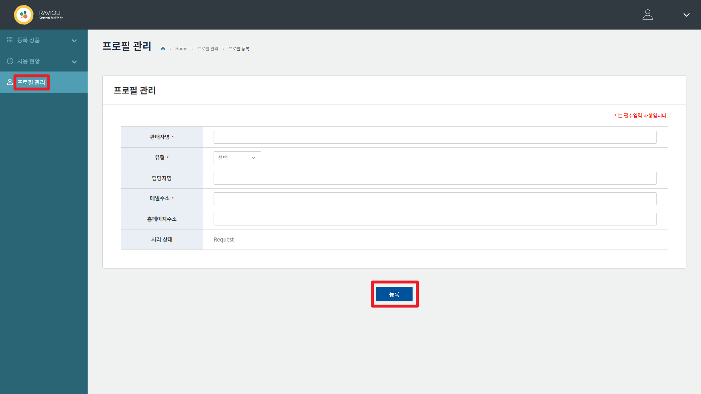

**3.3.3.2. 프로필 상세**

* 기등록한 판매자의 상세 프로필을 확인할 수 있다.

  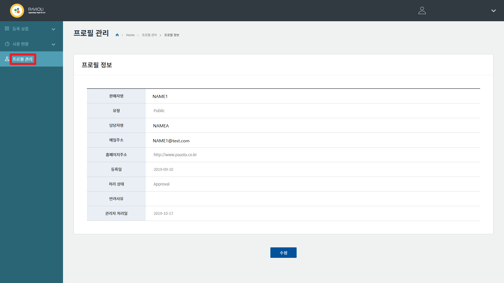

**3.3.3.3. 프로필 수정**

1. 기등록한 프로필에서 "수정"을 버튼을 클릭하여 프로필 수정 페이지로 이동한다. 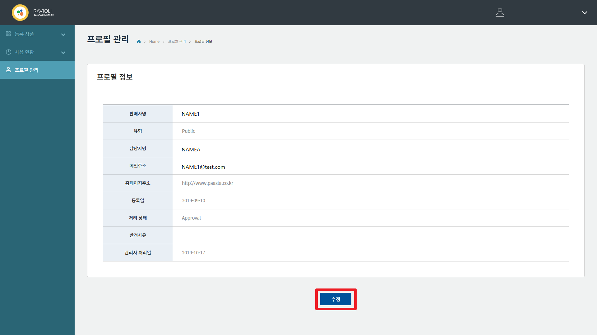  
2. 프로필 작성 완료 후 "저장" 버튼을 클릭한다. 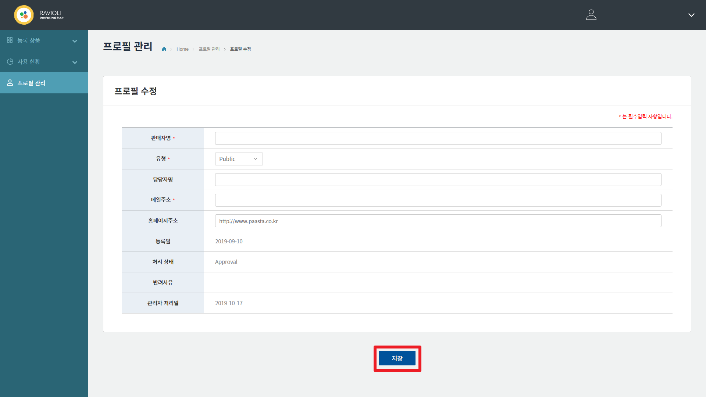   

### 3.4. 관리자 마켓플레이스

관리자 마켓플레이스는 상품, 사용자, 판매자 관리를 위한 메뉴로서 본 장에서는 관리자들의 상품 및 카테고리 관리와 사용 현황, 판매자 관리에 대한 설명을 기술한다.

| 분류 | 기능 | 설명 |
| :--- | :--- | :--- |

| 상품 관리 | 상품 관리 | 판매자가 등록한 상품정보 수정 |
| :--- | :--- | :--- |

| 판매자가 등록한 상품의 승인/반려 처리 |
| :--- |

| 판매자가 등록한 상품의 노출/비노출 처리 |
| :--- |

| 요금 정보 | 상품별 요금정책 정보 조회 |
| :--- | :--- |

| 카테고리 관리 | 카테고리 관리 | 상품 카테고리의 생성, 변경, 삭제, 조회 |
| :--- | :--- | :--- |

| 사용 현황 | 상품별 현황 | 상품별 실시간 사용량 조회 |
| :--- | :--- | :--- |

| 상품별 정보 목록 조회 |
| :--- |

| 상품별 사용자 추이 조회 |
| :--- |

| 판매자별 현황 | 판매자별 등록 상품의 실시간 사용량 조회 |
| :--- | :--- |

| 전체 판매자별 등록 상품의 정보 목록 조회 |
| :--- |

| 판매자별 판매된 상품 추이 조회 |
| :--- |

| 사용자별 현황 | 사용자별 사용상품의 실시간 사용량 조회 |
| :--- | :--- |

| 사용자별 사용상품의 정보 목록 조회 |
| :--- |

| 사용자 별 사용 추이 조회 |
| :--- |

| 판매자 관리 | 프로필 관리 | 판매자의 기본 정보 변경 |
| :--- | :--- | :--- |

| 판매자 승인/반려 처리 |
| :--- |

| 판매자 목록 조회 |
| :--- |

#### 3.4.1. 상품 관리

**3.4.1.1. 상품 목록 검색 조회**

* 전체 상품의 목록과 현황을 확인할 수 있다.
* 등록일/승인일, 카테고리, 전시여부, 승인여부, 판매자명, 상품명으로 검색할 수 있다.

  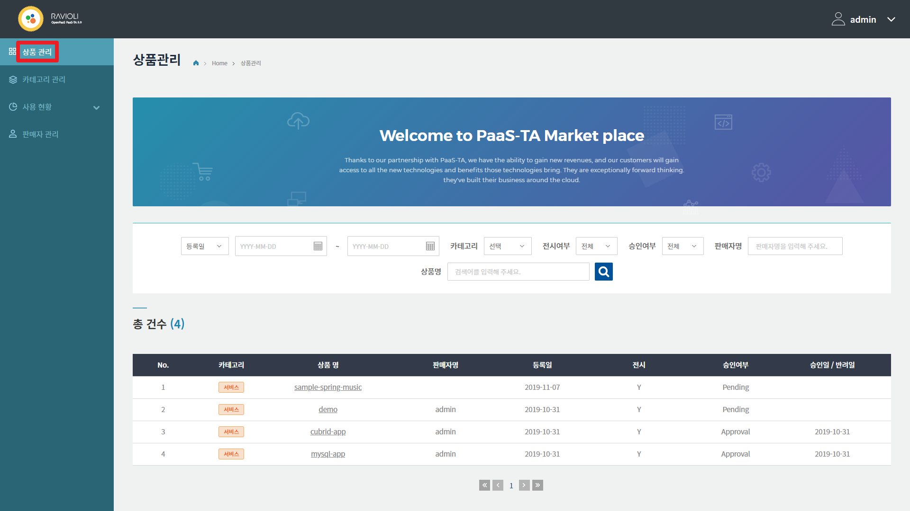

**3.4.1.2. 상품 상세 조회 및 수정**

1. 전체 상품 목록에서 항목을 선택하여 상품 상세 조회 페이지로 이동한다. 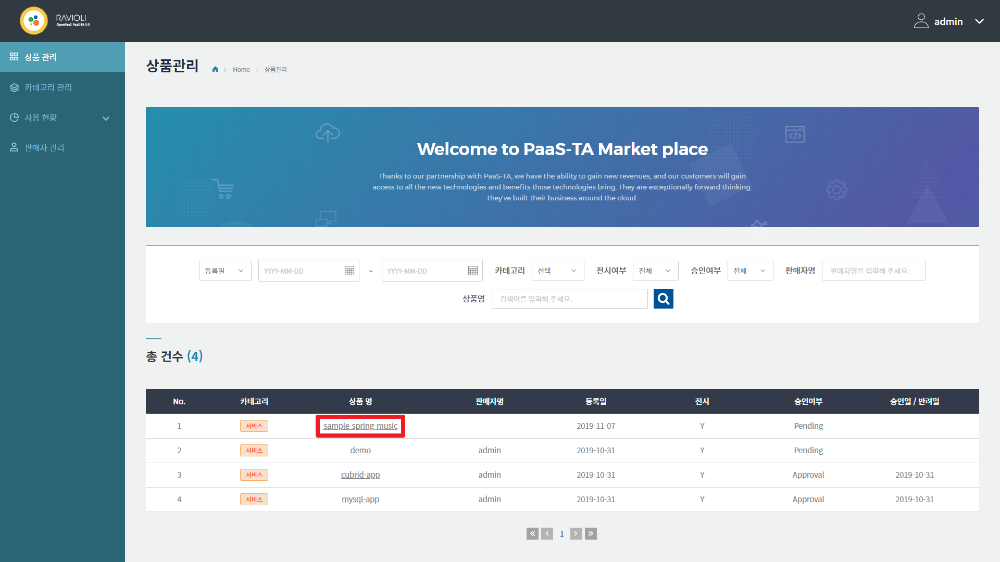  
2. 상세 정보 확인하고 "배포 테스트" 버튼을 클릭하여 테스트를 진행한다. 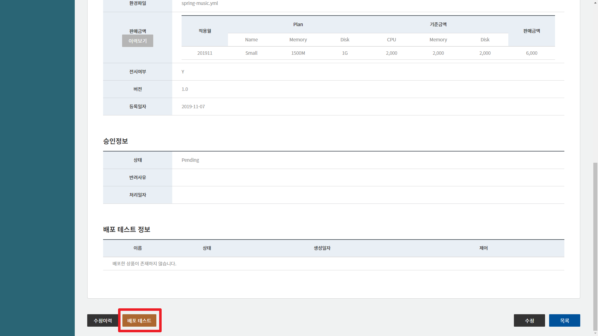  
3. "수정" 버튼을 클릭하여 상품 수정 페이지로 이동한다. 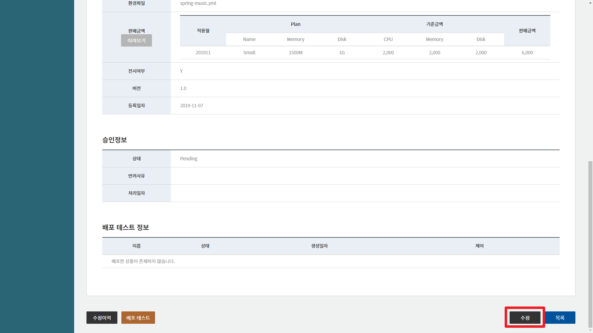  
4. 일부 활성화된 항목을 수정하거나 승인여부를 설정한 후 \(반려 시 반려사유도 작성\) "저장" 버튼을 클릭한다. 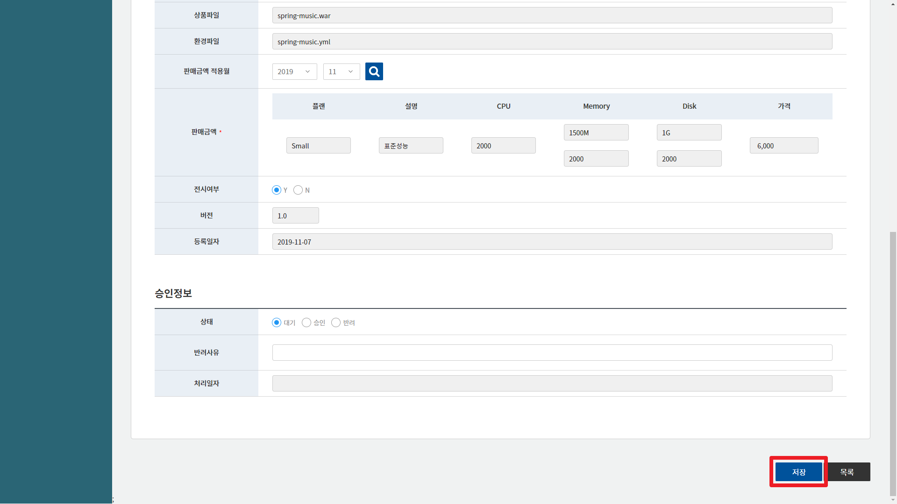  
5. "수정이력" 버튼을 클릭하여 수정이력을 확인할 수 있다. 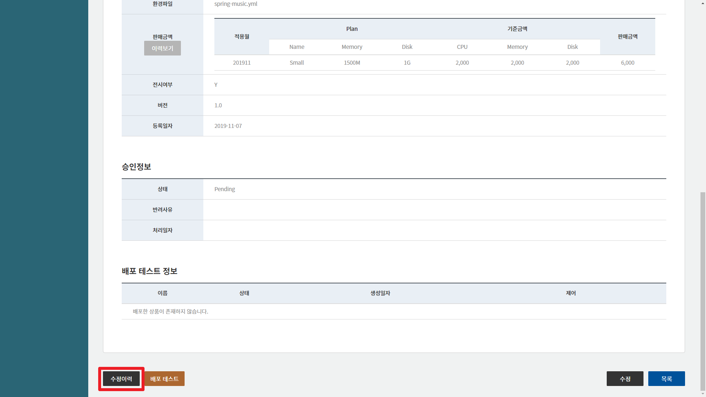   

#### 3.4.2. 카테고리 관리

**3.4.2.1. 카테고리 조회**

1. 전체 카테고리 목록을 확인한다. 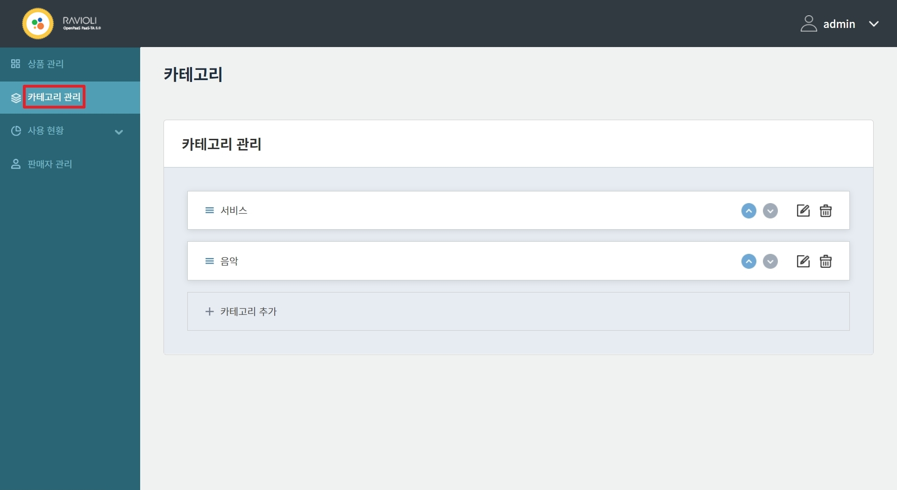  
2. 개별 카테고리 항목을 선택하여 상세 정보를 확인한다. 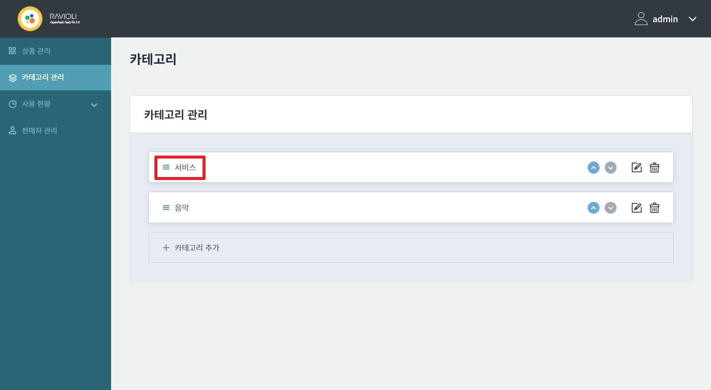  

**3.4.2.2. 카테고리 수정 및 삭제**

1. 전체 카테고리 목록 중 개별 항목의 ①"수정" 아이콘 혹은 ②"삭제" 아이콘을 눌러 수정 혹은 삭제 한다. 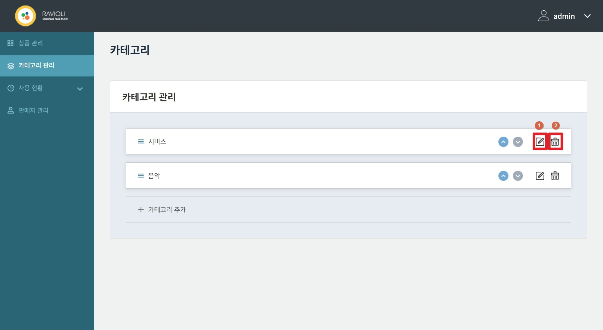  
2. 전체 카테고리 목록 중 개별 항목의 "위" 혹은 "아래" 아이콘을 눌러 순서를 재설정 한다. 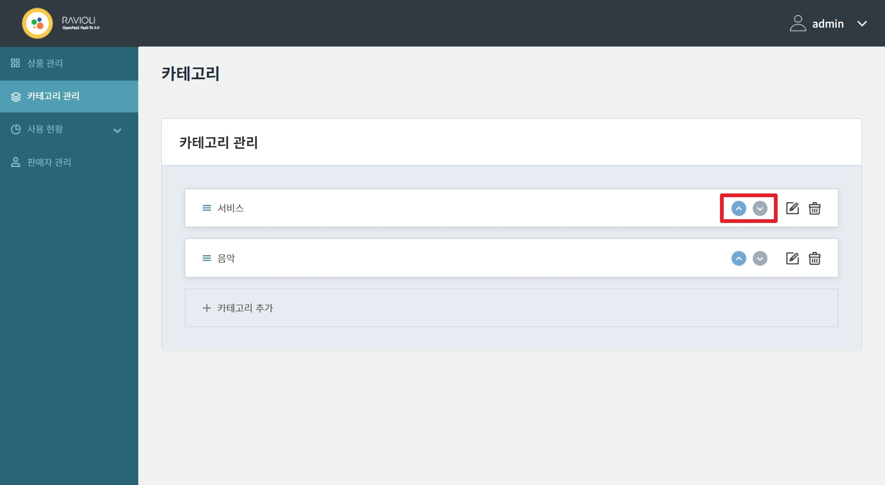  
3. 카테고리 상세 페이지에서 ①"수정" 버튼 혹은 ②"삭제" 버튼을 눌러 수정 혹은 삭제 한다. 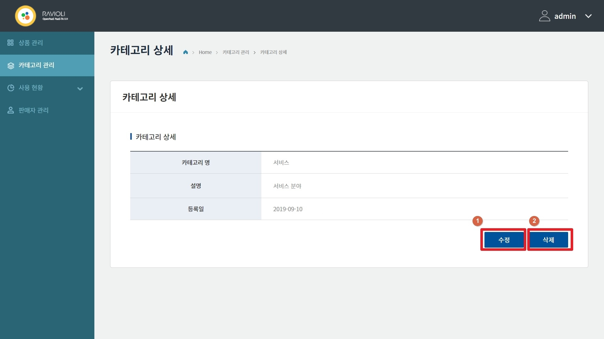  

**3.4.2.3. 카테고리 추가**

1. "카테고리 추가" 항목을 선택하여 카테고리 등록 페이지로 이동한다. 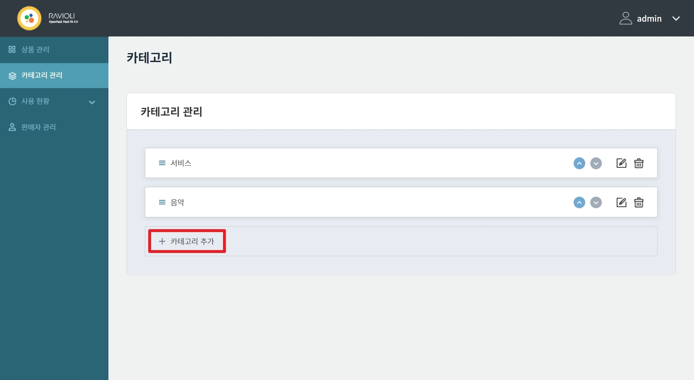  
2. 카테고리 명과 설명을 작성 후 "저장" 버튼을 클릭한다. 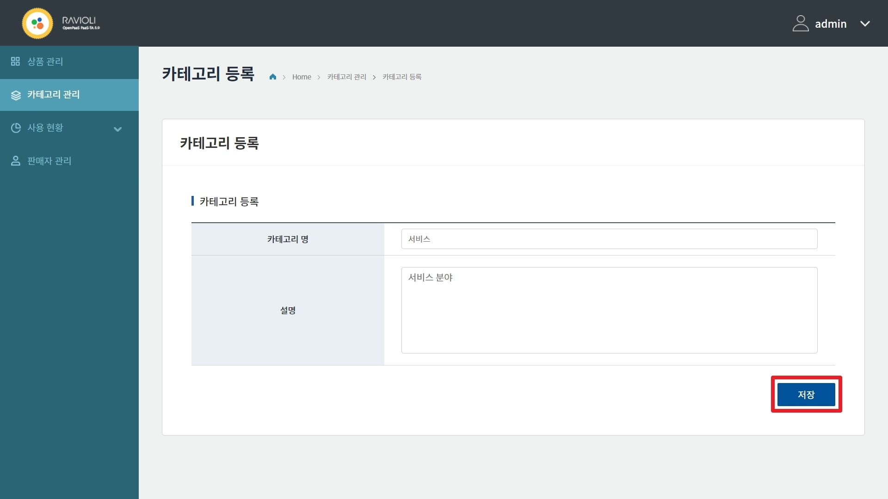   

#### 3.4.3. 사용 현황

**3.4.3.1. 상품별 현황**

**3.4.3.1.1. 상품별 현황 조회**

* 전체 상품의 목록과 판매 현황을 확인할 수 있다.
* 등록일, 카테고리로 검색할 수 있다.

  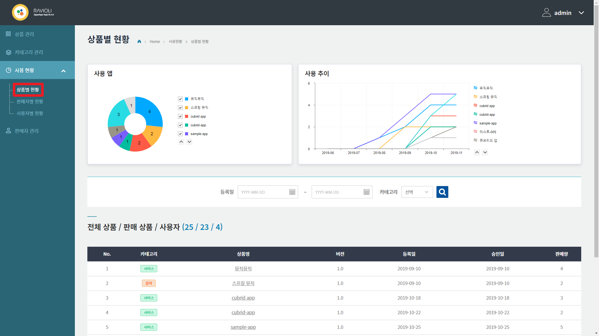

**3.4.3.1.2. 상품별 현황 상세**

1. 전체 상품 목록에서 항목을 선택하여 상품별 현황 상세 페이지로 이동한다.   
2. 상품별 현황 상세 정보와 판매 현황을 확인한다. 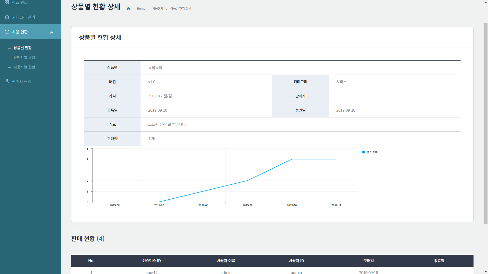  

**3.4.3.2. 판매자별 현황**

**3.4.3.2.1. 판매자별 현황 조회**

* 전체 판매자의 목록과 현황을 확인할 수 있다.
* 판매자명으로 검색할 수 있다.

  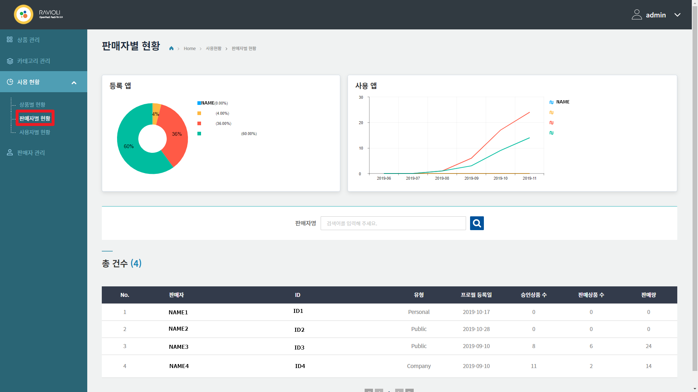

**3.4.3.2.2. 판매자별 현황 상세**

1. 전체 상품 목록에서 항목을 선택하여 판매자별 현황 상세 페이지로 이동한다. 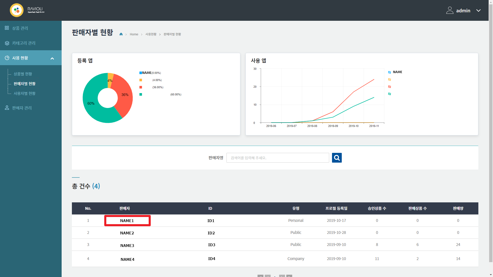  
2. 판매자별 현황 상세 정보와 판매자가 등록한 상품의 전체 현황 및 카테고리별 현황을 확인한다. 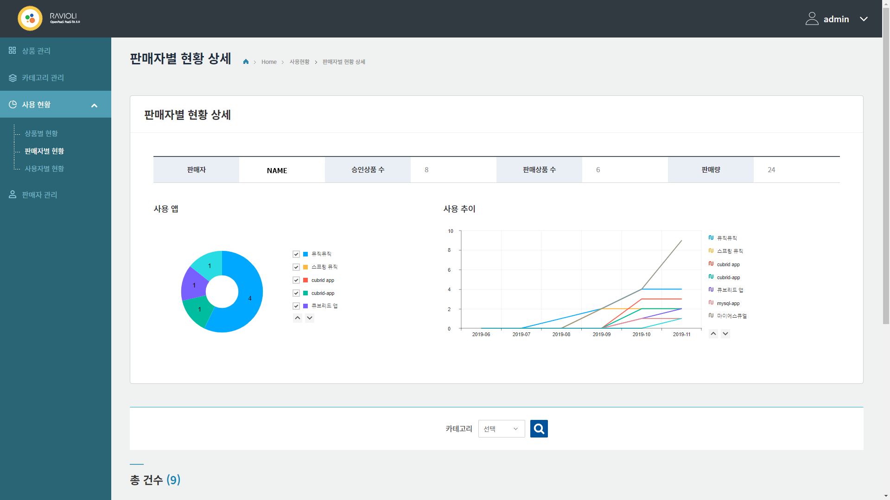  

**3.4.3.3. 사용자별 현황**

**3.4.3.3.1. 사용자별 현황 조회**

* 전체 사용자의 목록과 현황을 확인할 수 있다.
* 사용자명으로 검색할 수 있다.

  

**3.4.3.3.2. 사용자별 현황 상세**

1. 전체 사용자 목록에서 항목을 선택하여 사용자별 현황 상세 페이지로 이동한다.   
2. 사용자별 현황 상세 정보와 사용자가 구매한 상품의 전체 현황 및 이용기간, 카테고리별 현황을 확인한다.    

#### 3.4.4. 판매자 관리

**3.4.4.1. 판매자 목록 조회**

* 전체 판매자의 목록을 확인할 수 있다.
* 등록일자, 판매자명으로 검색할 수 있다.

  

**3.4.4.2. 판매자 프로필 상세 및 수정**

1. 전체 판매자 목록에서 항목을 선택하여 판매자별 프로필 상세 페이지로 이동한다.   
2. 판매자별 프로필 상세 정보를 확인한다.   
3. "수정" 버튼을 클릭하여 프로필 수정 페이지로 이동한다.   
4. 일부 활성화된 항목을 수정하거나 승인여부를 설정한 후 \(반려 시 반려사유도 작성\) "저장" 버튼을 클릭한다. 

