# PAAS-TA\_PLATFORM\_INSTALL\_AUTOMATION\_AZURE\_v1.0

## Table of Contents

1. [문서 개요](paas-ta_platform_install_automation_azure_v1.0.md#1)
   * [목적](paas-ta_platform_install_automation_azure_v1.0.md#2)
   * [범위](paas-ta_platform_install_automation_azure_v1.0.md#3)
2. [플랫폼 설치 가이드](paas-ta_platform_install_automation_azure_v1.0.md#4)
   * [플랫폼 설치 자동화 관리](paas-ta_platform_install_automation_azure_v1.0.md#5)
   * [로그인 계정 관리](paas-ta_platform_install_automation_azure_v1.0.md#6)
   * [인프라 관리](paas-ta_platform_install_automation_azure_v1.0.md#7)
   * [스템셀과 릴리즈](paas-ta_platform_install_automation_azure_v1.0.md#8)
   * [BOOTSTRAP 설치하기](paas-ta_platform_install_automation_azure_v1.0.md#9)
     * [인프라 환경 설정 관리](paas-ta_platform_install_automation_azure_v1.0.md#10)
     * [스템셀 다운로드](paas-ta_platform_install_automation_azure_v1.0.md#11)
     * [릴리즈 다운로드](paas-ta_platform_install_automation_azure_v1.0.md#12)
     * [디렉터 인증서 생성](paas-ta_platform_install_automation_azure_v1.0.md#13)
     * [BOOTSTRAP 설치](paas-ta_platform_install_automation_azure_v1.0.md#14)
   * [CF-Deployment 설치하기](paas-ta_platform_install_automation_azure_v1.0.md#15)
     * [스템셀 업로드](paas-ta_platform_install_automation_azure_v1.0.md#16)
     * [PaaS-TA 릴리즈 사용](paas-ta_platform_install_automation_azure_v1.0.md#17)
     * [CF-Deployment 설치](paas-ta_platform_install_automation_azure_v1.0.md#18)
   * [서비스팩 설치하기](paas-ta_platform_install_automation_azure_v1.0.md#19)
     * [릴리즈 업로드](paas-ta_platform_install_automation_azure_v1.0.md#20)
     * [Manifest 업로드](paas-ta_platform_install_automation_azure_v1.0.md#21)
     * [서비스팩 설치](paas-ta_platform_install_automation_azure_v1.0.md#22)

## 1.  문서 개요

### 1.1.  목적

본 문서는 플랫폼 설치 자동화 시스템의 사용 절차에 대해 기술하였다.

### 1.2.  범위

본 문서에서는 Azure 인프라 환경을 기준으로 플랫폼 설치 자동화를 사용하여 PaaS-TA를 설치하는 방법에 대해 작성되었다.

## 2.  플랫폼 설치 가이드

BOSH는 클라우드 환경에 서비스를 배포하고 소프트웨어 릴리즈를 관리해주는 오픈 소스로 Bootstrap은 하나의 VM에 디렉터의 모든 컴포넌트를 설치한 것으로 PaaS-TA 설치를 위한 관리자 기능을 담당한다.

플랫폼 설치 자동화를 이용해서 클라우드 환경에 PaaS-TA를 설치하기 위해서는 인프라 설정, 스템셀 소프트웨어 릴리즈, Manifest 파일, 인증서 파일 5가지 요소가 필요하다. 스템셀은 클라우드 환경에 VM을 생성하기 위해 사용할 기본 이미지이고, 소프트웨어 릴리즈는 VM에 설치할 소프트웨어 패키지들을 묶어 놓은 파일이고, Manifest파일은 스템셀과 소프트웨어 릴리즈를 이용해서 서비스를 어떤 식으로 구성할지를 정의해 놓은 명세서이다. 다음 그림은 BOOTSTRAP을 이용하여 PaaS-TA를 설치하는 절차이다.


### 2.1  플랫폼 설치 자동화 관리

플랫폼 디렉터의 코드/권한/사용자 관리를 통해 전체 사용자의 생성 및 사용 권한과 공통 Manifest 버전/신규 스템셀 확장 등의 공통 코드를 사용할 수 있다.

### 2.2.  로그인 계정 관리

플랫폼 설치 자동화 웹 화면에서 “플랫폼 관리자 관리” -&gt; “로그인 계정 관리” 메뉴로 이동한다. 플랫폼 설치 자동화는 “로그인 계정 관리” 메뉴에서 기본적으로 플랫폼 설치 자동화 관리자 정보\(admin/admin\)를 제공한다.

#### 1. _로그인 계정 등록_

1. 사용자 “등록” 버튼을 클릭 후 사용자 정보 입력 및 해당 사용자의 권한을 선택하여 “확인” 버튼을 클릭한다.
2. 사용자 등록 후 초기 비밀번호는 “1234” 이며, 최초 로그인 후 비밀번호를 변경할 수 있다.


#### 2. _로그인 계정 수정_

1. 사용자 “수정” 버튼을 클릭 후 사용자 정보 및 해당 권한을 수정하여 “확인” 버튼을 클릭한다.
2. 관리자는 선택한 사용자의 아이디는 수정할 수 없지만 비밀번호를 변경할 수 있다.


### 2.3  인프라 관리

BOOTSTRAP & PaaS-TA를 설치하기 위해서는 사전에 인프라 환경 구축이 필요하다. 인프라 관리 메뉴는 실제 인프라의 대시보드 화면에서도 환경 구축을 할 수 있다. 플랫폼 설치 자동화 웹 화면에서 “인프라 환경 관리” 의 “인프라 계정 관리” 메뉴에서 Azure 인프라 계정을 등록하고 “Azure 관리” 메뉴로 이동하여 등록 한 Azure 계정을 설정 후 해당 Azure 계정에 대한 실제 Azure 인프라 리소스를 제어할 수 있다.

#### 1. _Azure 계정 설정_

1. “인프라 환경 관리” -&gt; “인프라 계정 관리” 화면으로 이동한다
2. 전체 인프라 계정 관리 화면에서 “Azure 계정 관리” 화면으로 이동한다.
3. Azure계정 관리 화면에서는 “등록” 버튼을 클릭한다
4. Azure계정 등록 팝업 화면에서 플랫폼 설치에 필요한 인프라 계정 정보를 입력하고 “확인” 버튼을 클릭한다.

 

※ 계정 등록 정보

* Subscription ID: 실제 Azure Portal 청구 아이디
* Tenant ID: 실제 Azure Portal Active Directory Properties의 디렉토리 아이디
* Application ID: 실제 Azure Portal Active Directory App의 아이디
* Application Secret: 실제 Azure Portal Active Directory App의 Password

#### 2. _Azure 리소스 관리_

1. Azure 관리 화면에서 등록 한 Azure를 기본 계정으로 설정하여 실제 Azure 리소스를 제어할 수 있다.
2. “인프라 환경 관리” -&gt; Azure 관리 화면으로 이동한다.
3. 아래는 Opensack 관리 화면에서 실제 PaaS-TA 설치에 필요한 Azure 리소스의 환경이다.

|  인프라 환경 |  메뉴 |
| :--- | :--- |
|  Azure 리소스 관리 |  Resource Group |
|  Virtual Network & Subnet |  |
|  Storage Accout |  |
|  Public IP |  |
|  Key Pair |  |
|  Security Group |  |
|  Route Table |  |

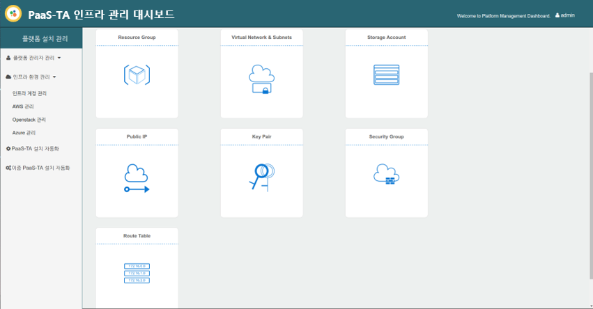

#### 3. _Azure 리소스 그룹 등록_

1. “Azure관리” 메뉴에서 “Resource Group 관리” 메뉴를 클릭한다.
2. “생성” 버튼을 클릭한다.
3. Resource Group 생성 팝업 화면에서 정보를 입력 후 “확인” 버튼을 클릭한다.

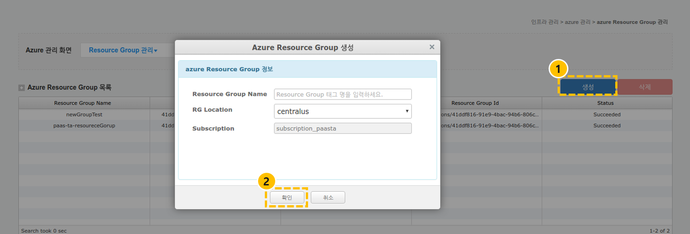

※ Azure Resource Group 생성 입력 정보

* Resource Group Name: 생성할 Resource Group 명
* RG Location: 생성할 Resource Group의 위치 선택 \(각 Location 별 특이 사항이 존재할 수 있음, 본 가이드 테스트 환경은 Service Limit이 충분한 Koreasouth Location 사용\)
* Subscription: Azure 기본 계정의 Subscription의 명칭\(자동 입력\)

#### 4. _Azure 네트워크 생성 & 서브넷 생성_

1. “Azure관리” 메뉴에서 “Virtual Network & Subnet 관리” 메뉴를 클릭한다.
2. “생성” 버튼을 클릭한다.
3. 네트워크 생성 팝업화면에서 정보를 입력 후 “확인” 버튼을 클릭한다.

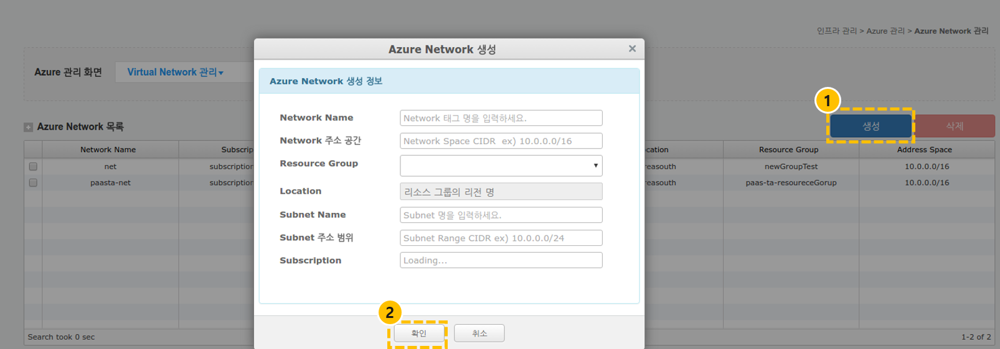

※ Azure 네트워크 생성 입력 정보

* Network Name: 생성할 네트워크 명
* Network 주소 공간: 생성할 네트워크의 주소 범위
* Resource Group: 어느 Resource Group에 네트워크를 생성할 것인지 선택
* Location: 선택 한 Resource Group의 Location\(자동 입력\)
* Subnet Name: 네트워크에 할당할 기본 서브넷 명
* Subnet 주소 범위: 네트워크의 주소 공간에 할당할 기본 서브넷의 주소 범위
* Subscription: Azure 기본 계정의 Subscription의 명칭\(자동 입력\)

1. PaaS-TA 및 기타 서비스를 설치 하기위해 Subnet을 추가할 경우 아래의 절차를 반복한다.
2. 생성 한 네트워크를 선택하고 “서브넷 추가” 버튼을 클릭한다.
3. 서브넷 생성 팝업화면에서 정보를 입력 후 “확인” 버튼을 클릭한다.

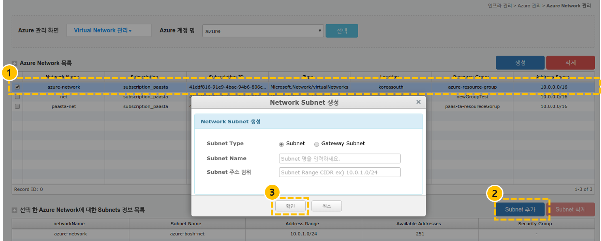

※ Azure 서브넷 생성 입력 정보

* Subnet Type: 서브넷 유형 선택 \(본 가이드에서는 일반 subnet으로 생성하였다.\)
* Subnet Name: 네트워크에 할당할 기본 서브넷 명
* Subnet 주소 범위: 네트워크의 주소 공간에 할당할 기본 서브넷의 주소 범위

#### 5. _Azure Storage Account생성_

1. “Azure관리” 메뉴에서 “Storage Account 관리” 메뉴를 클릭한다.
2. 정보를 입력 후 “생성” 버튼을 클릭한다.

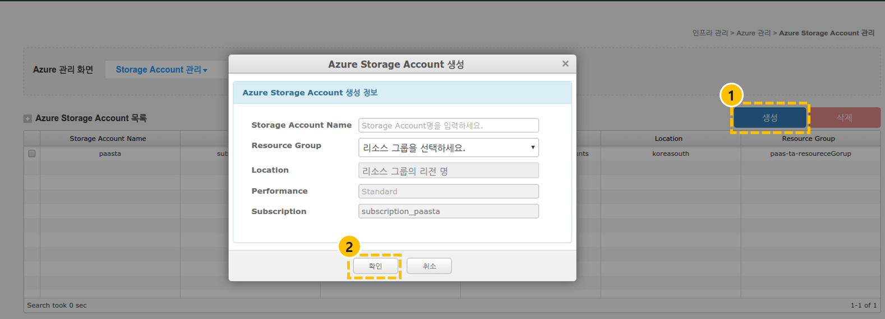

※ Azure Storage Account 생성 입력 정보

* Storage Account Name: 생성할 Storage Account 명
* Resource Group: 어느 Resource Group에 Storage Account를 생성할 것인지 선택
* Location: 선택 한 Resource Group의 Location\(자동 입력\)
* Performance: Azure Storage Account의 Performance Type\(자동 입력\)
* Subscription: Azure 기본 계정의 Subscription의 명칭\(자동 입력\)

1. PaaS-TA Instance 정보와 Stemcell 메타 데이터 정보를 저장하기 위해 Blob을 추가해야 한다.
2. 생성한 Storage Account를 선택하고 “Blob 생성” 버튼을 클릭한다.
3. Blob 생성 팝업화면에서 정보 입력 후 “확인” 버튼을 클릭한다.
4. 아래 화면에서 Private/Blob Access Level의 blob 2개를 생성한다.


※ Azure Storage Blob 생성 입력 정보

* Public Access Level: Blob Access Level, Private는 Bosh 인스턴스 정보 저장 관련 Blob이고 Blob은 스템셀 메타데이터 정보 관련 Blob
* Blob Name: Blob Level에 따른 Blob Name \(자동 입력\)

1. PaaS-TA Stemcell 정보를 저장하기 위해 Table을 추가해야 한다.
2. 생성한 Storage Account를 선택하고 “Table 생성” 버튼을 클릭한다.
3. Table 생성 팝업 화면에서 정보 입력 후 “확인” 버튼을 클릭한다.

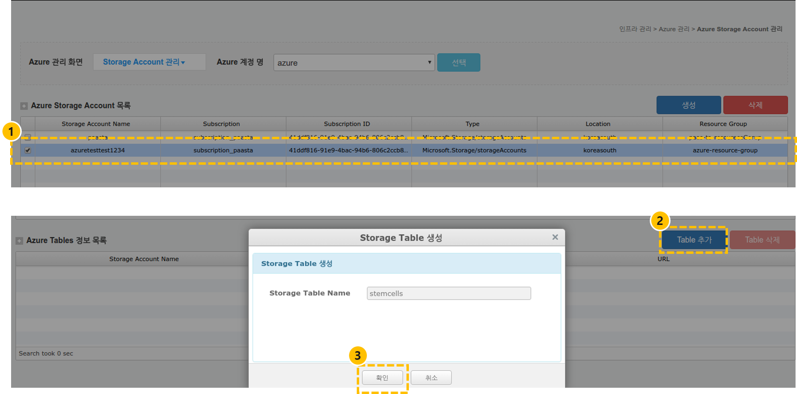

※ Azure Storage Table 생성 입력 정보

* Storage Table Name: 생성할 Storage Table Name \(자동 입력\)

#### 6. _Azure Public IP 할당_

1. “Azure 관리” 메뉴에서 “Public IPs 관리” 메뉴를 클릭한다.
2. “IP 할당” 버튼을 클릭한다.
3. Azure Public IP 할당 팝업 화면에서 정보를 입력 후 “할당” 버튼을 클릭한다.
4. PaaS-TA 설치를 위해 총 2개의 Public IP가 필요하다.

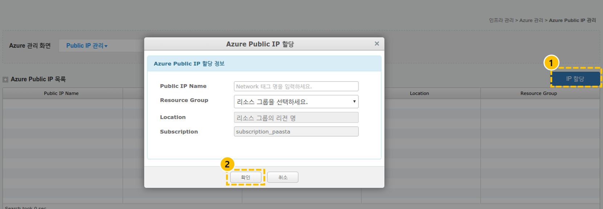

※ Azure Public IP 할당 입력 정보

* Public IP Name: 할당할 Public IP 명
* Resource Group: 어느 Resource Group에 Public를 생성할 것인지 선택
* Location: 선택 한 Resource Group의 Location\(자동 입력\)
* Subscription: Azure 기본 계정의 Subscription의 명칭\(자동 입력\)

#### 7. _Azure Key Pair 생성_

1. “Azure 관리” 메뉴에서 “Key Pair 관리” 메뉴를 클릭한다.
2. “생성” 버튼을 클릭한다.
3. Key Pair 생성 팝업 화면에서 정보를 입력한다.
4. Azure Key Pair 생성 후 읽기 권한으로 변경이 필요 할 수 있다. 생성한 Key Pair는 ${user\_home}/.ssh/디렉토리에 생성되며 private key파일에 대하여 $ chmod 400 \#{Private Key Name} 절차가 필요할 수 있다.


※ Azure Key Pair 생성 입력 정보

* Key Pair Name: 생성할 Key Pair 명

#### 8. _Azure 보안 그룹 생성_

1. “Azure 관리” 메뉴에서 “Security Group 관리” 메뉴를 클릭한다.
2. “생성” 버튼을 클릭한다.
3. Security Group 생성 팝업 화면에서 정보를 입력한다.
4. 초기 생성 Security Group는 모든 Inbound 포트에 대하여 열려 있는 상태이다.


※ Azure Security Group 생성 입력 정보

* Security Group Name: 생성할 Security Group 명
* Resource Group: 어느 Resource Group에 Security Group를 생성할 것인지 선택
* Location: 선택 한 Resource Group의 Location\(자동 입력\)
* Performance: Azure Security Group의 Performance Type\(자동 입력\)
* Subscription: Azure 기본 계정의 Subscription의 명칭\(자동 입력\)

#### 9. _Azure Router Table 생성 & 서브넷 연결_

1. “Azure 관리” 메뉴에서 “Router Table 관리” 메뉴를 클릭한다.
2. “생성” 버튼을 클릭한다.
3. Router Table 생성 팝업 화면에서 정보를 입력한다.


※ Azure Router Table 생성 입력 정보

* Router Table Name: 생성할 Router Table 명
* Resource Group: 어느 Resource Group에 Router Table을 생성할 것인지 선택
* Location: 선택 한 Resource Group의 Location\(자동 입력\)
* Subscription: Azure 기본 계정의 Subscription의 명칭\(자동 입력\)

1. Router Table에 서브넷을 연결하기 위해 생성한 Router Table을 선택하고 “Subnet 연결” 버튼을 클릭한다.
2. Subnet 연결 팝업화면에서 네트워크와 서브넷을 선택하고 ”확인” 버튼을 클릭한다.
3. 생성한 Router Table에 Network의 Subnet을 모두 연결한다.

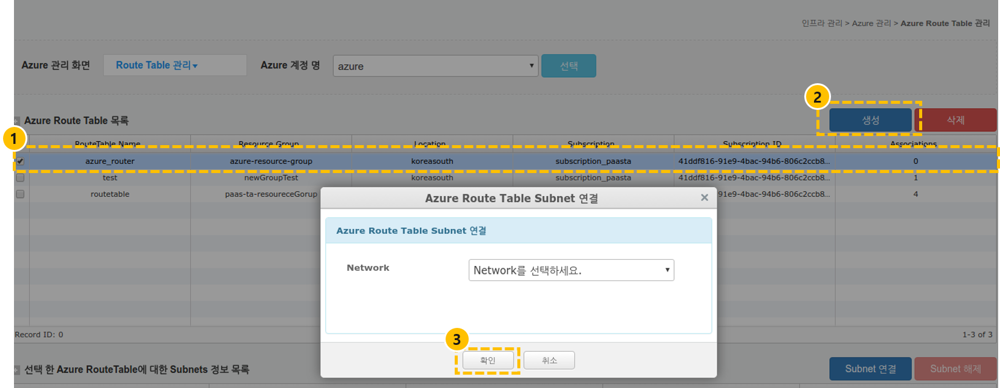

※ Azure 서브넷 연결 입력 정보

* Network: Router Table에 연결한 생성한 Network 명칭 선택
* Subnet: Router Table에 연결할 Network의 Subnet 명칭 선택

### 2.4  스템셀과 릴리즈

플랫폼 설치 자동화를 통해 배포 가능한 BOOTSTRAP 버전은 아래와 같으며, 아래의 지원 가능한 버전을 이용하지 않을 경우 에러가 발생할 수 있다. 따라서 아래의 릴리즈 버전으로 다운로드 및 설치한다.

| BOSH 릴리즈 | CPI 릴리즈 | BPM | 스템셀 |
| :--- | :--- | :--- | :--- |
| bosh/267.8.0 | bosh-azure-cpi/35.2.0 | bpm/0.9.0 | bosh-azure-hyperv-ubuntu-trusty-go\_agent/3586.24 |
| bosh/268.2.0 | bosh-azure-cpi/35.4.0 | bpm/0.12.3 | bosh-azure-hyperv-ubuntu-xenial-go\_agent/97.17 |
| bosh/270.2.0 | bosh-azure-cpi/36.0.1 | bpm/1.1.0 | bosh-azure-hyperv-ubuntu-xenial-go\_agent/315.64 |

플랫폼 설치 자동화를 통해 배포 가능한 CF-Deployment 버전은 아래와 같으며, 아래의 릴리즈 버전으로 다운로드&업로드 및 설치한다.

| BOSH 릴리즈 | CPI 릴리즈 |
| :--- | :--- |
| cf-deployment/2.7.0 | bosh-azure-hyperv-ubuntu-trusty-go\_agent/3586.25 |
| cf-deployment/3.2.0 | bosh-azure-hyperv-ubuntu-trusty-go\_agent/3586.27 |
| cf-deployment/4.0.0 | bosh-azure-hyperv-ubuntu-trusty-go\_agent/3586.40 |
| cf-deployment/5.0.0 | bosh-azure-hyperv-ubuntu-xenial-go\_agent/97.18 |
| cf-deployment/5.5.0 | bosh-azure-hyperv-ubuntu-xenial-go\_agent/97.28 |
| cf-deployment/9.3.0 | bosh-azure-hyperv-ubuntu-xenial-go\_agent/315.36 |
| cf-deployment/9.5.0 | bosh-azure-hyperv-ubuntu-xenial-go\_agent/315.64 |
| paasta/4.0 | bosh-azure-hyperv-ubuntu-xenial-go\_agent/97.28 |
| paasta/4.6 | bosh-azure-hyperv-ubuntu-xenial-go\_agent/315.36 |
| paasta/5.0 | bosh-azure-hyperv-ubuntu-xenial-go\_agent/315.64 |

### 2.5  BOOTSTRAP 설치하기

플랫폼 설치 자동화를 이용하여 인프라 환경 설정 및 BOOTSTRAP을 설치하고, 디렉터로 등록하는 절차는 다음과 같다.


#### 2.5.1. _인프라 환경 설정 관리_

BOOTSTRAP을 설치하기 위해서는 설치할 인프라의 환경 설정 정보를 등록해야 한다. PaaS-TA를 설치하기 위해 “PaaS-TA 설치 자동화” 메뉴를 클릭하여 플랫폼 설치 자동화 대시보드화면으로 이동한다. 플랫폼 설치 자동화 웹 화면에서 “환경 설정 및 관리” -&gt; “인프라 환경 설정 관리” 메뉴로 이동한다. “인프라 환경 설정 관리” 메뉴에서는 AWS/OPENSTACK/vSphere/GOOGLE/Azure 등 5개 인프라의 전체 환경 설정 목록 조회 기능과 관리 화면으로 이동하는 기능을 제공한다.

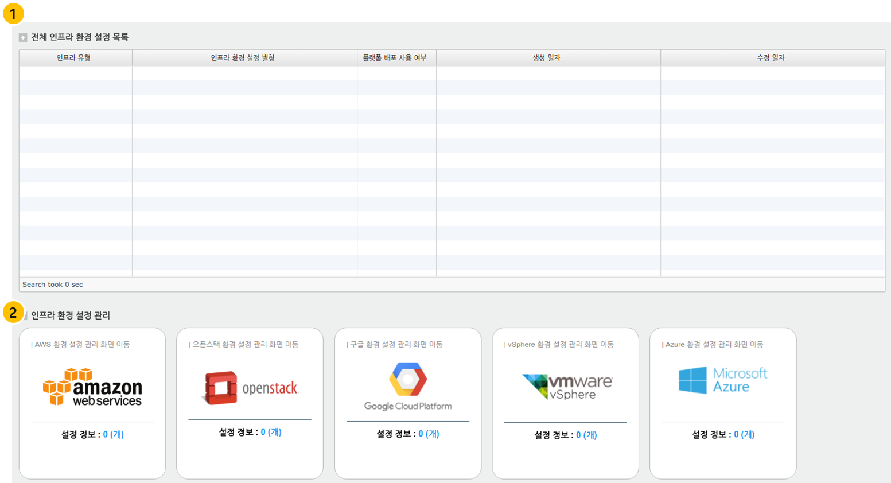

환경 설정 관리 화면 이동 컨테이너를 클릭하여 플랫폼 설치에 필요한 각 계정 정보를 등록한다.

**1. Azure 환경 설정 등록**

1. Azure 환경 설정 관리 화면에서는 “등록” 버튼을 클릭한다.
2. Azure 환경 설정 등록 팝업 화면에서 플랫폼 설치에 필요한 인프라 환경 설정 정보를 입력하고 “확인” 버튼을 클릭한다.

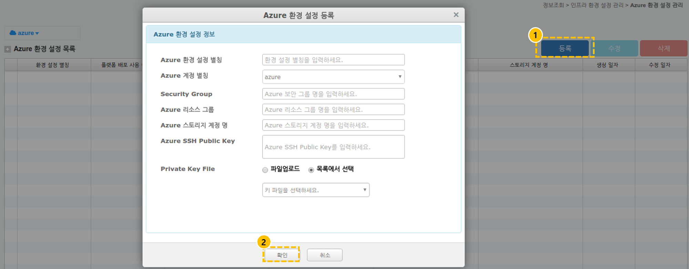

※ Azure 환경 설정 등록 정보

* Azure 환경 설정 별칭: 생성할 환경 설정 Azure 별칭
* Azure 계정 별칭: 인프라 관리에서 등록한 Azure 계정 정보 선택
* Security Group: 인프라 관리에서 등록한 Azure Security Group 명칭
* Azure 리소스 그룹: 인프라 관리에서 등록한 Azure 리소스 그룹 명칭
* Azure 스토리지 계정: 인프라 관리에서 등록한 Azure 스토리지 계정 명칭
* Azure SSH Public Key: 인프라 관리에서 등록한 Azure Key Pair 중 Public Key 입력
* Azure SSH Private Key: 인프라 관리에서 등록한 Azure Key Pair 중 Private Key 선택

#### 2.5.2. _스템셀 다운로드_

플랫폼 설치 자동화 웹 화면에서 “환경설정 및 관리” -&gt; “스템셀 관리” 메뉴로 이동한다. “스템셀 관리” 메뉴에서는 Cloud Foundry에서 제공하는 공개 스템셀을 다운로드할 수 있는 기능을 제공한다. 스템셀 다운로드 유형은 총 3가지이며 Version유형으로 다운로드가 안될 경우 로컬에서 다운로드 후 로컬에서 선택 유형/스템셀 다운로드 URL을 통해 다운로드 받는 유형을 이용한다. 상단에 위치한 “등록” 버튼을 클릭 후 스템셀 정보를 입력하고 “확인” 버튼을 클릭한다.

```text
https://bosh.io/stemcells/bosh-azure-hyperv-ubuntu-xenial-go_agent
```

**가이드에서는 버전 Ubuntu Xenial 315.64를 다운로드 하였다.**


※ 스템셀 등록 입력 정보

* 스템셀 명: 등록할 스템셀 명
* IaaS 유형: PaaS-TA 설치 인프라를 선택
* OS 유형: 스템셀 OS 유형 선택 현재 Azure에서는 Ubuntu/Windows를 지원한다.
* OS 버전: OS의 버전 선택
* 스템셀 다운 유형: 다운로드 유형 선택

#### 2.5.3. _릴리즈 다운로드_

BOOTSTRAP을 설치하기 위해서는 BOSH 릴리즈와 BOSH CPI릴리즈 2개의 릴리즈가 필요하며, BOSH 릴리즈 버전 266 이상일 경우 BPM 릴리즈가 더 추가되어 총 3개의 릴리즈가 필요하다. 릴리즈 다운로드 유형은 총 3가지이며 Version유형으로 다운로드가 안될 경우 로컬에서 다운로드 후 로컬에서 선택 유형/릴리즈 다운로드 URL을 통해 다운로드 받는 유형을 이용한다. 릴리즈를 다운로드하기 위해 플랫폼 설치 자동화 웹 화면에서 “환경설정 및 관리” -&gt; “릴리즈 관리” 메뉴로 이동 후 상단에 위치한 “등록” 버튼을 클릭하고, 릴리즈 등록 팝업 화면에서 릴리즈 정보 입력 후 “등록” 버튼을 클릭한다.

**1. BOSH 릴리즈**

1. 릴리즈 등록 팝업 화면에서BOSH 릴리즈 정보를 입력하고, “등록” 버튼 클릭한다.
2. BOSH 릴리즈 참조 사이트

   [http://bosh.io/releases/github.com/cloudfoundry/bosh?all=1](http://bosh.io/releases/github.com/cloudfoundry/bosh?all=1)


**본 가이드에서는 v270.2.0을 다운로드 하였다.**

**2. BOSH CPI 릴리즈**

1. 릴리즈 등록 팝업화면에서 BOSH CPI릴리즈 정보를 입력하고, “등록” 버튼 클릭한다.
2. BOSH-CPI 릴리즈 참조 사이트

| 인프라 환경 | 참조 사이트 |
| :--- | :--- |
| Azure | https://bosh.io/releases/github.com/cloudfoundry/bosh-azure-cpi-release?all=1 |


**본 가이드에서는 v36.0.1을 다운로드 하였다.**

**3. BPM 릴리즈**

1. 릴리즈 등록 팝업화면에서 BPM릴리즈 정보를 입력하고, “등록” 버튼 클릭한다.
2. BPM 릴리즈 참조 사이트

   [https://bosh.io/releases/github.com/cloudfoundry-incubator/bpm-release?all=1](https://bosh.io/releases/github.com/cloudfoundry-incubator/bpm-release?all=1)


**본 가이드에서는 v1.1.0을 다운로드 하였다.**

**4. OS CONF 릴리즈**

1. 릴리즈 등록 팝업화면에서 OS CONF 릴리즈 정보를 입력하고, “등록” 버튼 클릭한다.
2. OS CONF 릴리즈 참조 사이트

   [https://bosh.io/releases/github.com/cloudfoundry/os-conf-release?all=1](https://bosh.io/releases/github.com/cloudfoundry/os-conf-release?all=1)


**본 가이드에서는 v21.0.0을 다운로드 하였다.**

#### 2.5.4. _디렉터 인증서 생성_

BOOTSTRAP을 설치하기 위해서는 Nats/Director 컴포넌트를 사용하기 위한 인증서 정보, 디렉터 인증서가 필요하며 디렉터 인증서를 생성하기 위해 플랫폼 설치 자동화 웹 화면에서 “환경설정 및 관리” -&gt; “디렉터 인증서 관리” 메뉴로 이동 후 상단에 위치한 “등록” 버튼을 클릭하고, 디렉터 인증서 팝업 화면에서 디렉터 인증서 정보 입력 후 “등록” 버튼을 클릭한다.


※ 디렉터 인증서 등록 정보

* 디렉터 인증서 명: 등록할 디렉터 인증서 명
* BOOTSTRAP 공인 IPs: BOOTSTRAP 설치 시 사용할 Azure 아이피
* BOOTSTRAP 내부 IPs: BOOTSTRAP 설치 시 사용할 Azure Bosh Subnet 대역의 아이피
* BOOTSTRAP 공인 IPs 입력항목은 사용자의 설정에 따라 사용시 값을 입력할 수 있고, 사용하지 않을 경우 이를 제외한 항목만 채워 넣어도 디렉터 인증서 생성이 가능하다.

#### 2.5.5. _BOOTSTRAP 설치_

BOOTSTRAP 설치하기 위해 플랫폼 설치 자동화 웹 화면에서 “플랫폼 설치” -&gt; “BOOTSTRAP 설치” 메뉴로 이동 후 상단에 위치한 “설치” 버튼을 클릭한다.

**1. 클라우드 환경 선택**

1. 설치할 클라우드 환경을 선택하는 팝업화면에서 Azure를 선택한다.
2. “확인” 버튼을 클릭한다.


**2. BOOTSTRAP 설치 – 선택한 클라우드 환경 정보**

1. Azure 클라우드 환경을 선택한 경우 인프라 환경 설정 관리에서 설정한 Azure 인프라 환경 별칭을 선택 후 “다음” 버튼을 클릭한다.

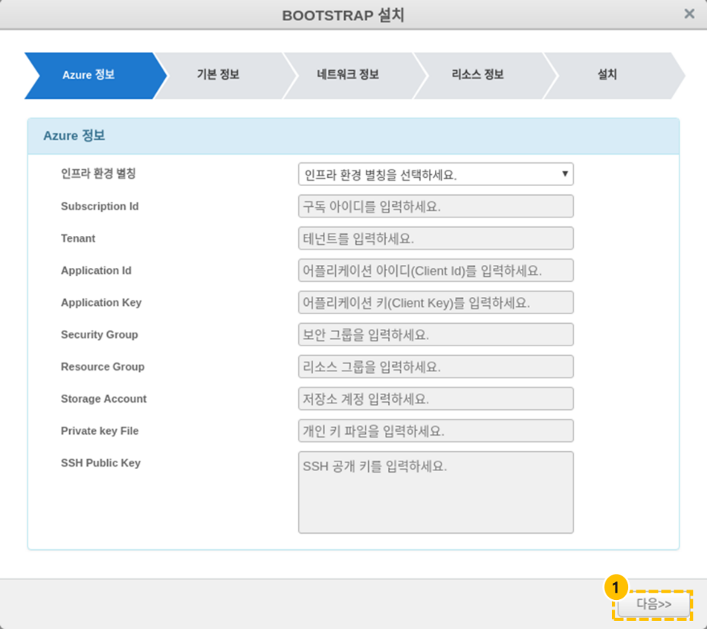

※ BOOTSTRAP Azure 입력 정보

* 인프라 환경 별칭: 등록 한 인프라 환경 설정 정보 선택
* Subscription ID: 인프라 환경 설정의 Azure 계정 Subscription 아이디 정보 \(자동입력\)
* Tenant: 인프라 환경 설정의 Azure 계정 Tenant 정보 \(자동입력\)
* Application ID: 인프라 환경 설정의 Azure 계정 Application 아이디 정보 \(자동입력\)
* Application Key: 인프라 환경 설정의 Azure 계정 Application 패스워드 정보 \(자동입력\)
* Security Group: 인프라 환경 설정의 Azure Security Group 명 \(자동 입력\)
* Resource Group: 인프라 환경 설정의 Azure Resource Group 명 \(자동 입력\)
* Storage Account: 인프라 환경 설정의 Azure Storage Account 명 \(자동 입력\)
* Storage Account: 인프라 환경 설정의 Private Key 파일 명 \(자동 입력\)
* SSH Public Key: 인프라 환경 설정의 Public Key 정보 \(자동 입력\)

**3. BOOTSTRAP 설치 – 기본 정보**

1. 아래의 기본 정보 입력 후 “다음” 버튼을 클릭한다.


※ BOOTSTRAP 기본 정보 입력 정보

* 배포 명: 등록할 BOOTSTRAP 배포 명
* 디렉터 명: 등록할 BOOTSTRAP의 디렉터 명 설치 후 실제 디렉터의 Alias 명칭이 된다.
* 디렉터 접속 인증서: 디렉터 인증서 관리에서 등록 한 디렉터 인증서 선택
* NTP: NTP 서버 시간
* BOSH 릴리즈: 설치할 BOSH 릴리즈를 선택
* BOSH-CPI 릴리즈: 설치할 BOSH-CPI 릴리즈를 선택
* BOSH-BPM 릴리즈: 설치할 BPM 릴리즈 선택, 특정 BOSH 버전 이상일 경우 사용
* OS-CONF 릴리즈: 설치할 OS-CONF 릴리즈를 선택
* 스냅샷기능 사용 여부: 스냅샷 사용 여부 \(특정 인프라에서만 사용 가능\)
* 스냅샷 스케쥴: 스냅샷 생성 스케쥴
* PaaS-TA 모니터링 정보: PaaS-TA 모니터링을 이용하려면 BOSH Release v270.2.0를 선택하고 PaaS-TA 모니터링 사용을 선택한다.

**BOOTSTRAP 릴리즈 Name Tag의 “?” 아이콘을 통해 현재 플랫폼 설치 자동화에서 설치 가능한 BOSH의 버전을 확인한다.**

**4. BOOTSTRAP 설치 – 클라우드 환경 별 네트워크 정보**

1. Azure 네트워크 정보 입력 후 “다음” 버튼을 클릭한다.


※ BOOTSTRAP 네트워크 등록 정보

* 디렉터 공인 IP: Azure Public IP 입력, 디렉터 인증서 생성 정보와 같아야 한다. 실제 디렉터 Target IP가 된다. 공인 IP를 사용하지 않을 경우 값을 입력하지 않는다
* 디렉터 내부 IP: Azure Subnet 대역의 아이피, 디렉터 인증서 생성 정보와 같아야 한다.
* 네트워크 명: 인프라 관리에서 생성한 Azure Network 명
* 서브넷 명: 인프라 관리에서 생성한 Azure Subnet 명
* 서브넷 범위: 인프라 관리에서 생성한 Azure Subnet의 범위
* 게이트웨이: 인프라 관리에서 생성한 Azure Subnet의 게이트웨이 주소\(default로는 1번 주소\)
* DNS: 도메인 네임 서버

**5. BOOTSTRAP 설치 – 리소스 정보**

1. Azure 리소스 정보 입력 후 “다음” 버튼을 클릭한다.


※ BOOTSTRAP 리소스 등록 정보

* 스템셀: 스템셀 관리에서 다운로드 한 스템셀 선택
* 인스턴스 유형: Azure 환경의 Instance Type

**6. BOOTSTRAP 설치 – 설치**

1. 생성된 배포 Manifest파일 정보를 이용하여 BOOTSTRAP설치를 실행하고 설치 진행 과정에 대한 로그를 확인한다
2. 설치가 완료되면 “닫기” 버튼을 클릭한다.


#### 2.5.6 _디렉터 설정_

BOOTSTRAP설치가 완료되면 BOOTSTRAP 디렉터 정보를 이용해서 플랫폼 설치 자동화의 디렉터로 설정한다. 디렉터를 등록 위해서는 플랫폼 설치 자동화 웹 화면에서 “환경설정 및 관리” -&gt; “디렉터 설정” 메뉴로 이동 후 상단에 위치한 “등록” 버튼을 클릭하고, 디렉터 등록 팝업 화면에서 디렉터 정보 입력 후 “등록” 버튼을 클릭한다. 이미 디렉터가 존재할 경우 디렉터를 선택하고 “기본 디렉터로 설정” 버튼을 클릭한다.

계정 및 비밀번호, 포트번호는 “admin/admin/25555”이다.


※ 디렉터 설정 등록 정보

* 디렉터 IP: BOOTSTRAP 설치 Azure IP 정보를 입력
* 포트번호: BOOTSTRAP 설치 Manifest의 Director Port 번호 입력\(default 25555\)
* 계정: BOOTSTRAP 설치 Manifest의 user\_management 아래 Director User 입력
* 비밀번호: BOOTSTRAP 설치 Manifest의 user\_management아래 Director Password 입력

### 2.6. _CF-Deployment 설치하기_

BOSH를 설치하고 플랫폼 설치 자동화의 디렉터로 설정이 완료되면 CF-Deployment를 설치할 준비가 된 상태로 PaaS-TA를 설치하는 절차는 다음과 같다.


#### 2.6.1 _스템셀 업로드_

플랫폼 설치 자동화에서 다운받은 스템셀을 “스템셀 업로드” 화면을 통해 디렉터에 315.64 버전의 스템셀을 업로드 한다.


#### 2.6.2 _PaaS-TA 릴리즈 사용_

※ 해당 절차는 PaaS-TA를 설치하기 위해 반드시 필요한 Compiled Local 릴리즈를 다운로드하는 절차이다. PaaS-TA를 설치하기 위해 필요한 절차이다. ※ 플랫폼 설치 자동화를 통해 배포 가능한 PaaS-TA 버전에 맞는 릴리즈와 스템셀을 PaaS-TA 공식 홈페이지 [https://paas-ta.kr/download/package에서](https://paas-ta.kr/download/package에서) 다운로드 받는다.

1. PaaS-TA 릴리즈 사용

   1.1. 다운로드 한 paasta 릴리즈 압축 파일을 scp 명령어를 통해 플랫폼 설치 자동화가 동작하고 있는 Inception 서버로 이동시킨다.

   ex\) $ scp -i {inception.key} ubuntu@172.xxx.xxx.xx {릴리즈 압축 일 명} \# Key Pair를 사용할 경우 ex\) $ scp ubuntu@172.xxx.xxx.xx {릴리즈 압축 일 명} \# Password를 사용할 경우

   1.2. 릴리즈 디렉토리를 생성하고 릴리즈 디렉토리에서 해당 릴리즈 파일의 압축을 해제한다. 릴리즈 디렉토리의 위치는 반드시 {home}/workspace/paasta-5.0/release/paasta여야 한다.

   * 디렉토리 생성

     ex\) $ mkdir -p workspace/paasta-5.0/release/paasta

   * 릴리즈 압축 파일 이동

     ex\) $ mv {릴리즈 압축 파일 명} workspace/paasta-5.0/release/paasta/

   * 릴리즈 파일 압축 해제

     ex\) $ tar xvf {릴리즈 압축 파일 명} \# 릴리즈 파일 확장자가 tar인 경우

     ex\) $ unzip {릴리즈 압축 파일 명} \# 릴리즈 파일 확장자가 zip인 경우

     1.3.    아래는 릴리즈 디렉토리의 PaaS-TA 릴리즈 형상 예시 그림이다.


#### 2.6.3 _CF-Deployment 설치_

CF-Deployment를 설치하기 위해 플랫폼 설치 자동화 웹 화면에서 “플랫폼 설치” -&gt; “CF-Deployment설치” 메뉴로 이동 후 상단의 “설치” 버튼을 클릭한다.

**1.    CF-Deployment설치 – 기본 정보 등록**

1. 배포에 필요한 기본정보와 도메인 / 로그인 비밀번호를 입력 후 “다음” 버튼을 클릭한다.


**본 가이드에서는 CF-Deployement 버전으로 Paasta 5.0을 사용하였다.**

※ CF-Deployment 기본 등록 정보

* 설치 관리자 UUID: 기본 디렉터의 UUID \(자동 입력\)
* 배포 명: CF-Deployment 설치 배포 명 입력
* CF-Deployment 버전: 플랫폼 설치 자동화에서 지원하는 CF Deployment 버전 선택
* CF Database 유형: CF Database 컴포넌트의 유형, Mysql로 설치 시 컴파일 시간이 오래 걸릴 수 있음
* Inception User Name: Inception 서버의 계정 명 ex\) vcap
* CF Admin Password: CF Login 패스워드 입력
* 도메인: CF 설치에 사용 할 도메인 입력 ex\) {public IP}.xip.io
* Portal 도메인: Portal을 설치 및 접속할 도메인 주소를 입력한다. Portal을 설치하지 않고 CF-Deployment를 실행할 경우 해당 값을 입력하지 않는다.
* PaaS-TA 모니터링 정보: PaaS-TA 모니터링을 이용하려면 paasta/5.0을 선택하고 PaaS-TA 모니터링 사용을 선택한다.

**2.    CF-Deployment설치 – 네트워크 정보 등록**

1. Azure의 네트워크 정보 입력 후 “다음” 버튼을 클릭한다.
2. “추가” 버튼을 클릭하여 네트워크를 추가하여 AZ를 분산 배치할 수 있다.


※ CF-Deployment 네트워크 등록 정보

* CF API TARGET IP: CF Deployment 설치 시 사용되는 Azure Public IP
* 네트워크 명: 인프라 관리에서 생성한 Azure 네트워크 명
* 서브넷 명: 인프라 관리에서 생성한 Azure 네트워크의 서브넷 명
* 보안 그룹: 인프라 관리에서 생성한 Azure 보안 그룹 명
* 게이트웨이: 인프라 관리에서 생성한 Azure 서브넷의 게이트웨이 주소
* DNS: DNS 서버 주소
* IP 할당 제외 대역: CF Deployment VM을 배치하지 않을 IP 주소 시작/끝 입력
* IP 할당 대역: CF Deployment VM을 배치할 IP 주소 시작/끝 입력

**3.    CF-Deployment설치 – Key 생성 및 정보 등록**

1. Key 생성 정보 입력 후 “Key 생성” 버튼을 클릭한다.
2. Key 생성 확인 후 “다음” 버튼을 클릭한다.


※ CF-Deployment Key 생성 등록 정보

* 도메인: CF Deployment 도메인 주소 \(자동 입력\)
* 국가 코드: 국가 코드 선택
* 시/도: 시/도 입력
* 시/구/군: 시/구/군 입력
* 회사명: 회사명 입력
* 부서명: 부서 명 입력
* Email: 이메일 주소 입력

**4.    CF-Deployment설치 – 리소스 정보 등록**

1. CF-Deployment 설치에 필요한 리소스 정보를 입력 후 “다음” 버튼을 클릭한다.
2. Azure 인프라 환경에서 Windows Stemcell을 사용할 경우 “스템셀 관리” 화면에서 Windows 용 스템셀 등록 “스템셀 업로드” 화면에서 해당 Windows 용 스템셀을 업로드 시켜 사용한다.


※ CF-Deployment 설치 리소스 생성 등록 정보

* Stemcell: 기본 디렉터에 업로드 한 스템셀 선택
* windows stemcell 사용: windows cell을 사용할 것인지 선택
* Small Resource Type: Azure 환경의 Small Instance Type
* Medium Resource Type: Azure 환경의 Medium Instance Type
* Large Resource Type: Azure 환경의 Large Instance Type

**5.    CF-Deployment설치 – 인스턴스 정보 등록**

1. Azure 환경일 경우 아래의 정보를 입력 후 “다음” 버튼을 클릭한다.
2. 인스턴스 수가 늘어나게 되면 해당 수만큼 네트워크 대역이 필요해 네트워크 할당 대역을 늘려줄 필요가 있다.


※ CF-Deployment Key 생성 등록 정보

* 인스턴스 수: VM에 할당할 인스턴스 수

**6.    CF-Deployment설치 – 설치**

1. 생성된 배포 Manifest파일 정보를 이용하여 CF-Deployment설치를 실행하고 설치 진행 과정에 대한 로그를 확인한다.


### 2.7. _서비스팩 설치_

BOSH 및 CF-Deployment 설치가 성공적으로 완료되고 배포할 Manifest를 업로드하면 서비스팩을 설치할 준비가 된 상태로 서비스팩을 설치하는 절차는 다음과 같다.


#### 2.7.1. _릴리즈 업로드_

PaaS-TA개발팀에서 제공하는 PaaS-TA 서비스 릴리즈에서 “릴리즈 다운로드”를 통해 다운 받는다. 그리고 “릴리즈 업로드”와 동일하게 디렉터로 업로드한다.

#### 2.7.2. _Manifest 업로드_

Manifest를 업로드 하기 위해 플랫폼 설치 자동화 웹 화면에서 “배포 정보 조회 및 관리” -&gt; “Manifest 관리” 메뉴로 이동 후 상단의 “업로드” 버튼을 클릭한다.

**1. Manifest 업로드 – 업로드**

1. 서비스팩 설치를 위해서는 배포 정보를 가지고 있는 Manifest 파일이 필요하다. 서비스팩 설치에 필요한 Manifest를 작성하여 플랫폼 설치 자동화에 업로드 한다.


**본 가이드에서는 PaaS-TA 서비스 influxdb-grafana Manifest를 업로드 하였다.** **업로드 할 Manifest는 모든 정보가 입력되어 있는 Pull Manifest여야 한다.**

#### 2.7.3. _서비스팩 설치_

서비스팩을 설치하기 위해 플랫폼 설치 자동화 웹 화면에서 “플랫폼 설치” -&gt; “서비스팩 설치” 메뉴로 이동 후 상단의 “설치” 버튼을 클릭한다.

**1.    서비스팩 설치 – Manifest 등록**

1. 배포에 필요한 Manifest 파일을 선택하고 “설치” 버튼을 클릭 한다


**2.    서비스팩 설치 – 설치**

1. 생성된 배포 Manifest파일 정보를 이용하여 서비스팩 설치를 실행하고 설치 진행 과정에 대한 로그를 확인한다.


